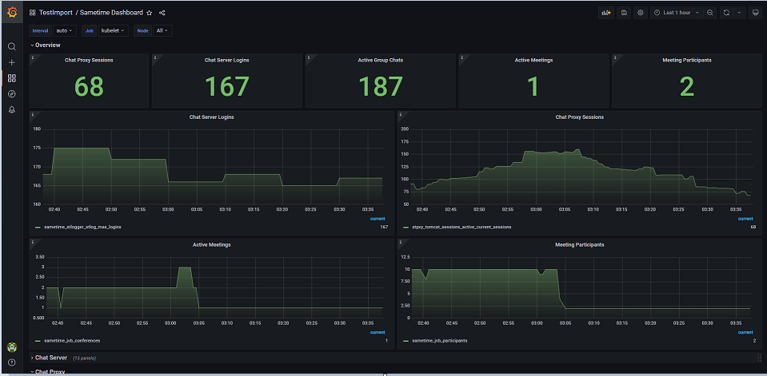

# Configuring {#configuring .task}

This section provides information on configuring the HCL Sametime server.

-   **[Adding corporate branding to meeting pages](customize_branding.md)**  
You can customize meetings to reflect your company's branding and visual presence.
-   **[Adding virtual backgrounds to the global library](t_configure_default_virtual_background.md)**  
By default, you can customize your meetings with virtual backgrounds and themes. As an administrator, you can choose which backgrounds and themes are available to all users.
-   **[Configuring alternate STUN servers](configuring_stun.md)**  
Sametime Meetings uses public Google STUN servers by default. To use different STUN servers, you must complete this procedure before installing Sametime Meetings.
-   **[Setting up business cards](admin_st_buscard.md)**  
You can configure the Sametime server so that business card information about an individual displays when a user hovers over a name in a chat window or a contact list. Business card information also displays at the top of an active chat window.
-   **[Configuring LDAP](configuring_ldap.md)**  
Sametime supports LDAP directory servers as the user repository.
-   **[Updating the time-to-live index for persistent chat](update_ttl_index.md)**  
The time-to-live \(TTL\) setting defines how long the chat history is stored in the database. The default value is 90 days. However, administrators can update the value based on the organization's preferred setting.
-   **[Managing secrets in Kubernetes](managing_secrets_kubernetes.md)**  
Sensitive information such as passwords, service account names, certificates, and other confidential data needed by Sametime pods are stored in secrets. In addition to helm charts and configuration map, the Sametime configuration is also derived from secrets.
-   **[Applying configuration changes in Docker](apply_configchanges_docker.md)**  
Configuration files contain environment variables that can be changed and applied to the Sametime server.
-   **[Applying configuration changes in Kubernetes](apply_configchanges_kubernetes.md)**  
Configuration files contain environment variables that can be changed and applied to the Sametime server.
-   **[Chat](chat_configuring.md)**  
This section contains Chat configuration considerations.
-   **[Meetings](meetings_configuring.md)**  
This contains configuration steps specific to the HCL Sametime Meetings server.
-   **[Integrating with other applications](verse_integration.md)**  
Integration with an application such as Verse prior to Sametime 12.0 requires the legacy web-client interface. Beginning in Sametime 12.0 the legacy web-client is not enabled by default, but can enabled when needed for integration with other products.
-   **[Monitoring your meeting and chat metrics with Grafana®](Managing_dashboard.md)**  
Sametime uses the third-party software, Grafana®, to generate insightful graphs and visualizations derived from time-series database \(TSDB\) data. This section covers the steps on how to use Grafana in your Sametime environment. 
-   **[Push messaging through a proxy](t_push_proxy.md)**  
Depending on your network settings, your firewalls could prevent Sametime proxy from connecting to push networks like Apple Push Notification service \(APNs\) and Firebase Cloud Messaging \(FCM\) through the Internet. Sametime supports the sending of APNS and FCM messages through a proxy server. If you need to send APNS or FCM message through a proxy server in your environment, you need to configure the settings for the messages you want routed through the proxy.

**Parent topic:**[HCL Sametime Administration Guide 12.0.1](administrator_doc.md)

