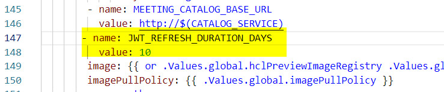

# Managing user sign-on {#control_validity_length .task}

You can control how long your Sametime meeting credentials are maintained to reduce the number of times you have to sign-in.

A token is maintained by the meeting sever to control how often you sign-in to your Sametime Meeting. The default value is 30 days. You can modify this value or turn off the feature by including the JWT\_REFRESH\_DURATION\_DAYS environment variable in the YAML file. You can specify any number of whole days to retain login credentials. To disable this feature, set the value to 0.

**Note:** When you modify the docker-compose.yml file, follow the syntax rules for YAML files to prevent coding errors. When you modify the YAML file, the indentations of entries are spaces, not tab characters.

**Parent topic:**[Managing Sametime Meetings](sametime_meeting_administering.md)

## Managing user sign-on in Docker {#task_vf2_mqz_xrb}

1.  Edit the docker-compose.yml file and locate the auth section within the file.

    The file is in the root directory .

2.  Add the JWT\_REFRESH\_DURATION\_DAYS environment variable.

    Specify the duration in this format environment\_variable=number\_of\_days.

    ```
    JWT_REFRESH_DURATION_DAYS=number\_of\_days
    ```

    The following example shows the auth section with the JWT\_REFRESH\_DURATION\_DAYS environment variable set to 10 days. 

3.  Run the following commands for changes to activate the YAML file.

    ```
    
    docker-compose down 
    delete jitsi-config folder
    docker-compose up -d
    ```


## Managing user sign-on in Kubernetes {#task_p3b_nqz_xrb}

You can change settings temporarily or permanently. To temporarily change the setting, run the following command to change the setting in a deployed environment:

```
kubectl set env deploy/auth JWT_REFRESH_DURATION_DAYS=number\_of\_days
```

To permanently change the setting, complete the following steps:

1.  Edit the deployment.yaml file, which contains the auth environment variables.

    You can find the file in the `helm/charts/auth/templates` directory.

2.  Add the JWT\_REFRESH\_DURATION\_DAYS environment variable.

    Specify the duration in this format environment\_variable: number\_of\_days.

    ```
    name: JWT_REFRESH_DURATION_DAYS value: number\_of\_days
    
    ```

    The following example shows the auth section with the JWT\_REFRESH\_DURATION\_DAYS environment variable set to 10 days. 

3.  Run the following commands to activate the YAML:

    ```
    
    helm uninstall sametime-meetings
    helm install sametime-meetings 
    ```


