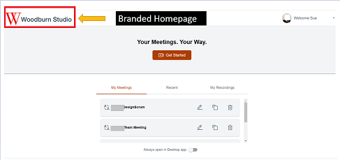
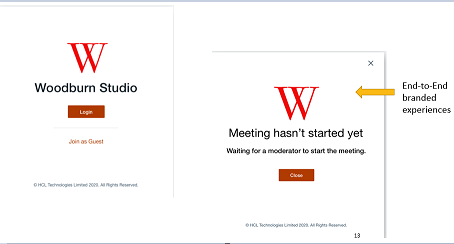

# Adding corporate branding to meeting pages {#customize_branding .task}

You can customize meetings to reflect your company's branding and visual presence.

You can include several levels of customizing for meetings to present a visual representation of your company. You can customize all or any combination of the three.

-   Add a company name and logo. The logo image is displayed on the login, in-meeting, and logout pages.

    

-   Change the Favicon and application icons.

    

-   Change the background image for meeting tile view.

-   **[Adding corporate branding to meeting pages using Kubernetes](customize_kubernetes.md)**  

-   **[Adding corporate branding to meeting pages using Docker](customize_docker.md)**  

**Parent topic:**[Configuring](configuring.md)

