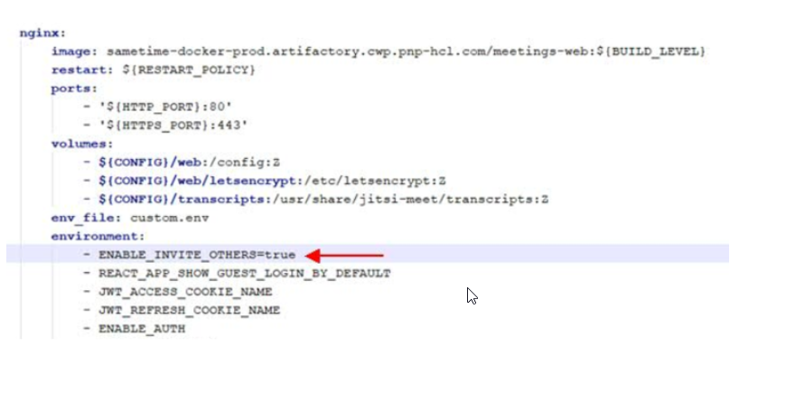

# Enabling meeting dial-out on Docker {#enable_dialout_docker .task}

1.  Edit the .env file and save the changes.

    Do not include the comments which are in parentheses \(\).

    ``` {#codeblock_cy2_2vy_mvb}
    JIGASI_SIP_SERVER=  (This is the SIP server/proxy IP or hostname. For hostname, this must be in DNS or added as extra_hosts entry in docker-compose.yml for the jigasi service.)
    
    JIGASI_SIP_PORT=5060  (This is the SIP server/proxy port)
    JIGASI_SIP_TRANSPORT=UDP  (This is SIP server/proxy protocol)
    JIGASI_SIP_URI= (This is the SIP URI, in plain text. Example: [mailto:mysipuser@mysipserver.com mysipuser@mysipserver.com] )
    JIGASI_SIP_PASSWORD= (This is the SIP user password, in plain text.)
    
    ```

2.  Edit the `docker_compose.yml` and save the changes.

    **Note:** The “-“ is required in front of the parameter.

    Under the JIGASI environment section, add the statement: `– JIGASI_PROXY_BYPASS`.

    

    Under NGINX environment section, add the statement: `- ENABLE_INVITE_OTHERS=true`.

    

    Under JICOFO environment section, add the statement: `- JIGASI_SIP_URI`.

    

3.  Apply the settings to Docker.

    To apply these settings to Docker, perform the following:

    ``` {#codeblock_hy2_2vy_mvb}
    cd to directory holding docker-compose.yml
    
    > docker-compose down
    > rm -rf jitsi-config/jigasi
    > docker-compose up -d
    ```


**Parent topic:**[Enabling meeting dial-out](enable_dial_out.md)

## Kubernetes {#task_psy_m3h_wrb}

1.  Edit the helm/values.yaml file and change the enableJigasi to true. The default is false.

    Add the following settings. Do not include the comments which are in parentheses \(\).

    ```
    jigasiSipServer:  (This is the SIP server/proxy IP or hostname. For hostname, this must be in DNS or added to CoreDNS config of Kubernetes.)
    jigasiSipPort: 5060  (This is the SIP server/proxy port)
    jigasiSipTransport: UDP (This is the SIP server/proxy protocol)
    jigasiProxyBypass: true  (If the SIP proxy is the only network path to the SIP infrastructure, this must be “false”. If the meeting infrastructure can directly hit the SIP endpoints, such as the SIP gateway to the PSTN, “true” can be set to bypass the proxy after a call is set up.)
    ENABLE_INVITE_OTHERS: true
    ```

2.  Configure the SIP user account.

    The TMG server has a randomly generated passcode that should be shared with the meeting server. This is known as the secret. To share the secret with the meeting server, the value needs to base-64 encoded along with the name. From a command prompt enter the command:

    ```
    echo -n '{"ilink-TMG": "<secret\>"}' | base64
    ```

    Substitute the full secret for the <secret\> variable in the command. The resulting value that is echoed to the screen is the credential that needs to be configured on the meeting server.

    Open the /helm/templates/auth-config-secret.yaml file in edit mode. Locate the **application-registry.json** and remove the existing **eyB9** value and replace it with the encoded secret.

3.  Run the `helm list` command to find out the deployment name and current version. This is needed in the event a roll-back is needed.

4.  To apply the changes, change directories to the helm directory where the Sametime Meeting installer was decompressed, then run the following command:

    ```
    helm upgrade sametime-meetings 
    ```


