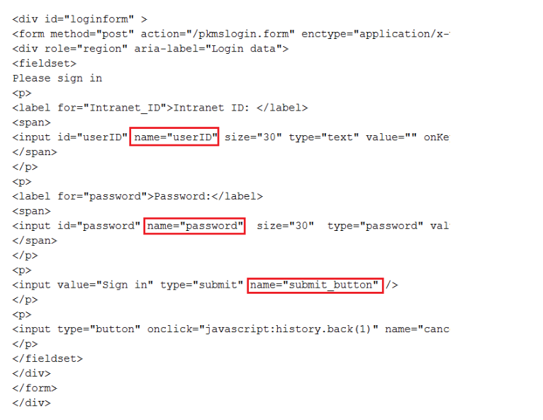

# Enabling SAML authentication in client installation packages {#enabling_saml .task}

Ensure that Sametime® Connect and Embedded clients can connect to the Sametime Community Server using SAML by adding the new trusted audience URL to the client preferences before installing or updating the clients.

Enable SAML authentication for the deployment as explained in [Enabling SAML authentication on the Sametime Community Server](enabling_sso_saml.md).

This task only applies to the Sametime Connect and Embedded clients; it does not affect web or mobile clients. During SAML login, Sametime redirects client connections from the initial IdP URL. If the redirected URL is not listed as a trusted site, Sametime stops loading the page and generates the following error message in the log:

`URL redirected_url is not in the trusted sites list.`

Ensure that Sametime Connect and Embedded clients can connect using SAML by adding the trusted site's URL to the client preferences before installing or updating the clients. This is the URL that you assigned in the `STSAML_TRUSTED_AUDIENCES` setting, as explained in [Configuration settings related to SAML authentication](configuring_sso_saml.md). For more information on configuring client installation packages, see[Configuring Sametime Connect client preferences with the Expeditor managed settings framework](config_client_mng_xml_pref.md).

Alternatively, users can enable SAML authentication themselves by modifying settings in the client. For more information, see [Enabling SAML authentication in installed clients](enabling_saml_clients.md)

1.  Determine your company's SAML IdP URL.

    The IdP URL is based on your Sametime Community Server host name, and provides the HTML page with at least 3 <input\> tags for the User name, Password, and Submit fields. Upon a submit action, the URL might redirect to one or more URLs and receive the SAML token in response.

2.  Decide whether you want to use `form` or `browser` as the IdP log-in type.

    If you want to log in to your company's authentication server by typing a user name and password in a Sametime dialog box, use `form` as the `idp.type`; otherwise use browser.

3.  Determine your company's SAML authentication settings by completing the following steps.

    1.  Browse to your IdP URL, view the HTML source of the log-in form, and collect the following values.
        -   `idp.form.username.tag` is the value in the name attribute of the Intranet ID label's `input` statement; this value is `userID`
        -   `idp.form.password.tag` is the value in the name attribute of the Password label's input statement; this value is password
        -   `idp.form.submit.tag` is the value in the name attribute of the `Sign in` input statement; this value is submit
    For example, if you browse to the example Community Server IdP URL, the following graphic shows where the values appear in the sample HTML source.

    

4.  Add the information collected in the previous steps to the Sametime `plugin_customization.ini` file by completing the following steps.

    1.  Open the `plugin_customization.ini` file.
        -   **Windows™:** the file is located inside the client installation package, in the `deploy` directory
        -   **Mac:** the file is located separately from the client installation package
    2.  Set the `samlTrustedSites` preference to the list all of the redirecting URLs used by your IdP; separate multiple URLs with a comma \(,\). If you have multiple SAML communities, include all of the redirecting URLs used by all of the SAML communities. If your IdP does not use redirecting URLs, leave this setting blank. Each URL can be as simple as `https://host_name`, or you can include a path as in `https://host_name/path` as shown in the following example.

        `com.hcl.collaboration.realtime.community/samlTrustedSites=https://host1,https://host2/path`

    3.  Set the `samlCommunities` preference to the list of fully qualified host names of all of your SAML communities; separate multiple host names with a semicolon \(;\).
    4.  Set the `sametime.example.com.idp` to the IdP URL that you determined in Step 1.

        For example, if the Community Server's host name is sametime.example.com, then the appropriate setting is the IdP URL determined in the example from Step 1, and shown in the following statement:

        `com.ibm.collaboration.realtime.community/sametime.example.com.idp=https://www.example.com/FIM/sps/SAML20/logininitial?TARGET=https://sametime.example.com&PROTOCOL=POST`

    5.  Add the log-in type that you selected in Step 2 to the `idp.type` setting.
    6.  Add the tag settings that you collected from the HTML for the log-in page source in Step 3 to the following settings:

        -   `idp.form.username.tag`
        -   `idp.form.password.tag`
        -   `idp.form.submit.tag`
        The following example shows completed settings using a log-in type of form and the tag settings from the sample HTML source shown in Step 2:

        `com.hcl.collaboration.realtime.community/sametime.example.com.idp.type=form`

        `com.hcl.collaboration.realtime.community/sametime.example.com.idp.form.username.tag=userID`

        `com.hcl.collaboration.realtime.community/sametime.example.com.idp.form.password.tag=password`

        `com.hcl.collaboration.realtime.community/sametime.example.com.idp.form.submit.tag=submit_button`

    7.  Save and close the file.
5.  **\(Mac clients only\):** If you can install clients with the `plugin_customization.ini` file located outside of the client package, skip to step 5. If your deployment mechanism requires a single file, add the `plugin_customization.ini` file to the client installation package as explained in the following steps.

    1.  Expand the client installation package.
    2.  Add the plugin\_customization.ini file.
    3.  Compress the revised package.
    4.  Email the revised package to support@collabserv.com and request that HCL sign the package and return it to you.
6.  Distribute the updated installation packages to your users.

    The SAML configuration information is automatically populated when your users install the client.

**Parent topic:**[Setting up SSO using SAML](enabling_sso_saml.md)

