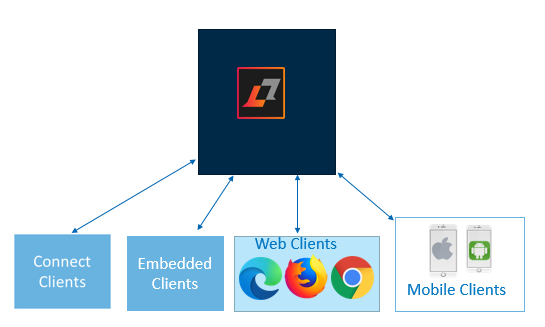

# Sametime clients {#hcl_sametime_clients .concept}

Several client types are supported providing flexibility in how users can access chats and meetings. A single deployment can implement several client types.

The following Sametime client types are supported:

Connect client
:   The Connect client is a stand-alone client that allows for connection to the Sametime server for meetings and chat. It is installed on the user's desktop and requires administrative privileges to perform the install. It can be installed on a Windows or MacOS platform. Provides access to chat features. Documentation for this client is provided as the Help within the client.

Embedded client
:   An Embedded client provides for connection to the Sametime server within another product. HCL Verse, HCL iNotes, HCL Connections, and HCL Digital contained an embedded Sametime client. Because it is part of the product, starting and using Sametime is done within the product it is embedded. Provides access to chat features. Documentation for this client is provided as the Help within the client.

Mobile client
:   Mobile clients provide access to a Sametime server using an iOS and Android mobile device. An HCL Sametime app must be installed on the mobile device to connect to the server. Provides access to chat and meeting features.

:   -   [HCL Sametime iOS Users Guide](https://help.hcltechsw.com/sametime/12/ios/index.html)
-   [HCL Sametime Android Users Guide](https://help.hcltechsw.com/sametime/12/android/index.html)

Progressive Web App \(PWA\) client
:   The PWA is a standalone app that than be installed from the Web client onto your machine. It allows you to access chat and meeting features from the installed app. Provides access to chat and meeting features.

Web client
:   The Web client provides for access to the Sametime server using a web browser. Provides access to chat and meeting features.

:   -   [Sametime Meetings Users Guide](https://help.hcltechsw.com/sametime/12/meetings/index.html)
-   [Sametime Chat Users Guide](https://help.hcltechsw.com/sametime/12/webchat/index.html)

**Parent topic:**[Planning](planning.md)

