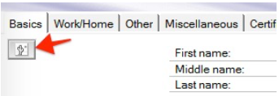

# Storing photos in the Domino directory {#storing_photos .task}

If the Sametime server is connected to a Domino LDAP server, you can store business cards photos in the Domino Directory.

The file name of the photo attached to the person document must be named ContactPhoto.jpg. Domino serves this photo as an attribute called Photo. It is possible to use a custom field with the attachment or thumbnail field type, photo types used by Domino are JPEG and GIF file types. Photo size should be smaller than 45 KB, for best results use a 10 KB sized photo. This option requires the Domino Designer Client and modifying the design, which is outside the scope of this document.

This configuration only applies to the rich clients. In order to display photos in meetings or webchat, you must use the PhotoURL attribute.

The Domino directory has a field in the person document that allows the user to upload their contact. It is saved as a thumbnail which automatically reduces the size of the file.

Important considerations:

-   Before storing photos in the name and address book, consider the size of the address book. Adding photos for many users can greatly increase the size of your directory and can have a performance impact on another application that uses the same Domino directory.
-   The Sametime server does not support this method of photo retrieval. If you have users with the mobile or web clients, consider using a PhotoURL instead of storing photos as attachments in the Domino directory.

1.  Open the Notes contact file using a Notes client. The default file is names.nsf.

2.  Locate and open the person document where the photos is to be attached.

3.  Click **Edit Person**.

4.  To the left of the **First name** and **Last name** fields, click the photo icon.

    

5.  Locate the .jpeg photo file on your hard drive and rename the file to ContactPhoto.jpg.

6.  Click the icon to upload the photo and browse to the location of the renamed photo file.

7.  Confirm that the photo is correct and click **Save and Close**.

**Parent topic:**[Setting up business cards](admin_st_buscard.md)

