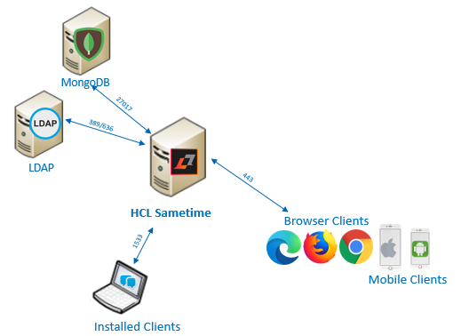

# System requirements {#system_requirements .concept}

System requirements includes the minimum HCL Sametime and HCL Sametime Premimum requirements, such as: operating systems, hardware, software, and more.

The minimum requirements must be available to install the product successfully. For detail system requirements, see the [System requirements](https://support.hcltechsw.com/csm?id=kb_article&sysparm_article=KB0097599) article.

The graphic below shows a simple topology with required components: MongoDB and LDAP. The system requirements article along with the installation and configuration topics provides details for including them in your environment.

**Parent topic:**[Prerequistes](c_planning_prereqs.md)

