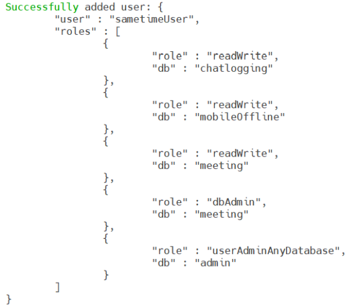
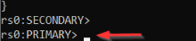

# Configuring MongoDB for Sametime {#configure_mongodb .task}

This topic describes how to configure MongoDB on both the Windows and Linux platform to support an HCL Sametime and HCL Sametime Premium deployment.

MongoDB security is not enabled by default. Securing MongoDB is not required for Sametime, but provides the best results. For more information, see [Enabling security in the MongoDB](security_mongodb.md).

**Note:** In the following steps, MongoDB version 4.4 is used as an example. If you are using a different version of MongoDB, refer to the MongoDB documentation for how to issue commands for the version that you are using.

1.  Start the MongoDB server as a service, if it has not already been started.

2.  Start the MongoDB console.

    -   For Windows, run the `mongo.exe` program which is in the following directory: C:\\Program Files\\MongoDB\\Server\\4.4\\bin
    -   For Linux, run \>mongo.
3.  From the MongoDB console, run the following commands to create `sametimeUser` in MongoDB.

    You can use and modify the following example. If you change the user and password, you must use the new values when you configure the Sametime server in a later step.

    ``` {#codeblock_w3f_z2t_4tb}
    
    use admin
    ```

    ``` {#codeblock_my3_d2f_4tb}
    
    db.createUser({user: "sametimeUser", pwd: "sametime", roles:[{role:"readWrite", db:"chatlogging"},{ role:"readWrite", db:"mobileOffline"},{ role:"readWrite", db:"meeting"},{role:"dbAdmin", db:"meeting"},{role:"userAdminAnyDatabase", db:"admin"}]})
    ```

    When complete, a message is displayed that the user was added along with details as shown in the following example.

    

4.  From the MongoDB console, run the following commands to create the **chatlogging** database with **events** and **sessions** collections in MongoDB.

    ``` {#codeblock_zfp_pgf_4tb}
    
    use chatlogging     
    
    ```

    ``` {#codeblock_ogy_pgf_4tb}
    
    db.EVENTS.insertOne({"_id" : "dummy"})
    ```

    ``` {#codeblock_z2c_qgf_4tb}
           
    db.SESSIONS.insertOne({"_id" : "dummy"}) 
    ```

    **Note:** The commands are case sensitive and must be typed as shown.

5.  Stop the MongoDB server and exit the console to pick up the new schema version change. To exit the MongoDB console, use the exit command.

    To shut down the MongoDB server:

    -   On Windows stop the MongoDB service
    -   On Linux use run the service mongod stop command
6.  Edit the mongod.cfg file.

    -   Windows: C:\\Program Files\\MongoDB\\Server\\4.4\\bin
    -   Linux: /etc/mongod.conf
    1.  Remove the comment character or add the `replication` statement. Add add `replSetName: rs0` under it.

        ``` {#codeblock_h41_fg4_htb}
        
        replication:
          replSetName: rs0
        ```

    2.  Under \# network interfaces, add `bindIpAll: true`.

        ``` {#codeblock_zqd_lg4_htb}
        
        net:
          port: 27017
          bindIp: 127.0.0.1
          bindIpAll: true
        ```

        **Note:**

        -   You can copy and paste the instructions from this document. Be aware that the format of the instructions is critical and must remain the same. The indentations are two spaces and not a tab. Also, there can be no trailing spaces at the end of each line.
        -   If the MongoDB logs and data were different from the default values, confirm this file needs to be updated correctly.
    3.  Save the file. Make sure the file is not saved as a .txt filetype when saving.

7.  Start the MongoDB service.

    -   For Windows, start the MongoDB Server \( MongoDB\) service from the Wiondows Services panel.
    -   For Linux, run the following command:

        ``` {#codeblock_pk4_fp5_m5b}
        service mongod start 
        ```

8.  Start the MongoDB console.

    -   For Windows:

        ``` {#codeblock_y55_jp5_m5b}
        C:\Program Files\MongoDB\Server\4.4\bin\mongo.exe
        ```

    -   For Linux:

        ``` {#codeblock_id2_lp5_m5b}
        >mongo 
        ```

9.  From the MongoDB console, run the following command to initiate the Replica Set in MongoDB.

    ``` {#codeblock_ysr_m34_htb}
    
    rs.initiate()
    ```

    **Note:** For Windows, review the message that is displayed. The expected message is rs0:Secondary or rs0:OTHER. Press **Enter** and the message changes to rs0:Primary\>. rs.conf\(\)

    

10. The replica set is now operational. To view the replica set configuration, run the command from the MongoDB Console. To check the status of the replica set, use the rs.status\(\) command.

    At this point, you can exit the console using the exit command.

    **Note:** When MongoDB is not configured on the local host, the configuration must reflect the correct host name or IP. See the [HCL Sametime 11 clients fail when MongoDB host is not configured correctly on the Community server](https://support.hcltechsw.com/csm?id=kb_article&sysparm_article=KB0076424) article for known issues.


After the MongoDB is configured, you can install Sametime. Refer to the [Installing Sametime](installation_sametime.md) topic for details.

**Parent topic:**[Installing the MongoDB](installation_mongodb.md)

