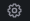
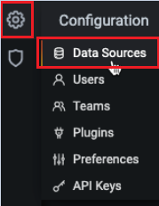

# Configuring Docker to run Grafana {#t_grafana_docker .task}

-   Open the following ports for the different monitoring services:
    -   Grafana: `3001`
    -   Prometheus: `9091`
    -   Pushgateway: `9092`
    -   Node-exporter: `9100`
    -   Cadvisor: `8088`
-   When applicable, ensure that these services are up and active for panels to be working.

    -   Pushgateway: `http://host.docker.internal:9092`
    -   Proxy metrics: `http://host.docker.internal:8081/actuator/prometheus `
    -   Cadvisor: `http://host.docker.internal:8088/containers`
    **Note:** You can use `localhost` instead of the Docker address if you are on a local server.


Before you can create your first dashboard, you need to add your data source.

**Note:** Only users with the organization Admin role can add data sources.

To run Grafana and import your dashboard, follow these steps:

1.  Update the `docker-compose.yml` file. In community \> environment, add the evironment variable below.

    ``` {#codeblock_cjg_w41_mvb}
    MONITORING_ENABLED=true
    ```

2.  Run the command to start monitoring services.

    ``` {#codeblock_cky_zsz_lvb}
    docker-compose -f docker-compose.yml -f docker-compose-monitoring.yml up -d
    ```

3.  Navigate to the Grafana sign-in page in your browser.

    ``` {#codeblock_s5j_gpz_lvb}
    localhost:3001
    ```

    **Note:** `3001` is the default port for Grafana. Alternatively, you can use `http://host.docker.internal:3001`if you are using a remote setup.

4.  Enter *admin* for both username and password, and then select **Sign In**. If successful, you will be prompted to change the password.

5.  Select **OK** and enter the new password.

6.  From the side menu, select **Settings** .

    

7.  Select **Data sources**.

8.  Select **Add data source**.

9.  Select **Prometheus** as the data source.

10. Open the Prometheus data source and edit the settings. Under the HTTP section, enter the following URL.

    ``` {#codeblock_sjt_gy1_mvb}
    http://host.docker.internal:9091
    ```

11. Select **Save and test**. A message is displayed to confirm if the data source is working.

12. Upload the Docker\_Sametime\_Dashboard.json file. For more information, contact [HCL Customer Support](https://hclpnpsupport.hcltech.com/csm).

13. Select **Prometheus \(default\)** as data source and then select **Import**.

14. Save the dashboard.


**Parent topic:**[Monitoring your meeting and chat metrics with Grafana®](Managing_dashboard.md)

