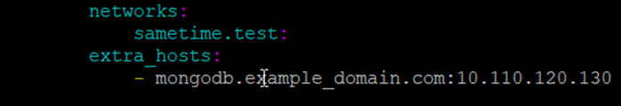
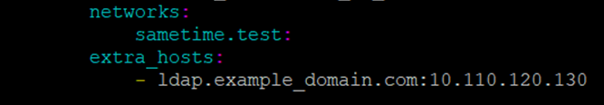
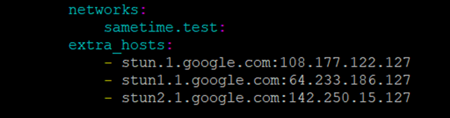

# Defining extra hosts for Docker deployments {#t_installing_docker_extrahosts .task}

Extra hosts for Docker deployments can be defined when there are network or DNS issues. Defining extra hosts is optional and not a requirement to ensure the connections are successful.

In some cases on CentOS 8, the host names fail to resolve properly. If the DNS is unreliable in resolving host names to IP addresses, these can be defined manually in the configuration. The following steps work for all supported Linux versions.

**Note:** When modifying the `yml` file, the indentations use spaces to indent the text. Do not use tabs. The entries within the file must line up exactly.

Use the `networks:` placement as a reference for `extra_hosts:` and the `sametime.test:` placement as a reference for where the `-` is placed.

1.  Open the docker-compose.yml file in edit mode.

    1.  The following components require a connection to the MongoDB server. Locate and update each section with the MongoDB host name and IP address.

        -   community
        -   recordings
        -   files
        -   click2call
        -   location
        -   catalog
        -   app-registry
        -   activity
        -   backgrounds
        -   lobby
        After `networks` add an `extra_hosts` statement, where mongoDB\_host is the fully qualified hostname of the MongoDB server and mongoDB\_IP\_address is the IP address of the MongoDB server.

        ``` {#codeblock_cn5_mpq_15b}
        
        extra_hosts: 
            - mongoDB\_host: mongoDB\_IP\_address
        ```

        For example:

    2.  The community component requires a connection to the LDAP server. Locate and update this section with the LDAP host name and IP address.

        After `networks` add an `extra_hosts` statement, where ldap\_hostname is the fully qualified host name of the LDAP server and ldap\_ip\_address is the IP address of the LDAP server.

        ``` {#codeblock_shp_nqq_15b}
        
        extra_hosts: 
            - ldap.host: ldap\_ip\_address
        ```

        For example:

    3.  The jvb component requires a connection to the STUN servers. In the `jvb` section, add an `extra_hosts` section an include a statement for each STUN server, where stun\_host\_name is the fully qualified host name of the STUN server, and stun\_ip\_address is the IP address of the STUN server.

        ``` {#codeblock_wjd_sd2_q5b}
        
            - stun\_host\_name:stun\_ip\_address
            
        ```

        For example:

        ``` {#codeblock_m1c_szn_4tb}
        
        extra_hosts:
            - stun_host_name:stun_ip_address
            - stun1_host_name:stun1_ip_address
            - stun2_host_name:stun2_ip_address  
        ```

        Resolve the host names of the STUN servers and use the corresponding IP address for your region. In the following graphic, the Google STUN servers are used with the regional resolved IP addresses.

2.  Verify that the formatting is correct. Correct any indentations using spaces.

3.  Save the changes.

4.  Run the following commands to apply the changes.

    ``` {#codeblock_jn2_znq_15b}
    
    docker-compose down
    ```

    ``` {#codeblock_xsn_14q_15b}
    
    docker-compose up -d
    ```


**Parent topic:**[Installing Sametime in a Docker environment](installation_sametime_docker.md)

