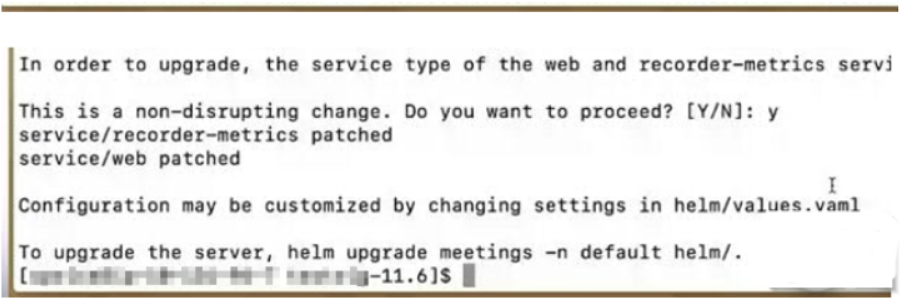

# Upgrading Sametime 11.5 and Sametime 11.6 Kubernetes deployments {#upgrade_kubernetes .task}

To upgrade from Sametime 11.5 or Sametime 11.6 to Sametime 12, the following conditions must be satisfied:

-   HCL Sametime Meetings 11.5 or Sametime 11.6 must be installed and configured.
-   Sametime has access to a MongoDB server. You can re-use your existing MongoDB server.

    **Note:** There are no special configuration steps required for the database. It automatically creates when the Sametime server connects to MongoDB.

-   Prepare migration steps before upgrading to the latest Sametime version. The upgrade gives you a new community and proxy component that replaces your existing components.
    -   Have a back-out plan. Create a backup of the following files.
        -   docker-compose.yml
        -   custom.env
        -   .env
-   Docker Compose 1.29 or higher must be installed in your Sametime environment.

To upgrade from Sametime 11.5 or Sametime 11.6 to Sametime 12, follow these steps:

1.  Extract the 11.5, 11.6, or 11.6 IF1 zip files to any directory on either the master Kubernetes host itself or on a machine which has management access to the Kubernetes cluster.

2.  Deploy the docker images.

    ``` {#codeblock_q2q_byl_c5b}
    ./load.sh
    ```

3.  Edit values.yaml where needed.

4.  Run the command below to detect the current settings and copy or update them as needed.

    ``` {#codeblock_wzl_1zl_c5b}
    ./prepareDeployment.sh
    ```

    

5.  Answer **Y** to proceed. If **N** \(no\) is answered, the install script prompts for the necessary steps.

6.  Run the command below to upgrade to Sametime 12.

    ``` {#codeblock_mxm_tzl_c5b}
    helm upgrade meetings -n default helm/.
    ```


**Parent topic:**[Upgrading from Meetings 11.5 and 11.6](upgrading_meetings.md)

## Revert to the previous version {#task_sxq_dwl_c5b}

If you encounter a problem, run the helm command to roll back to the previous version.

