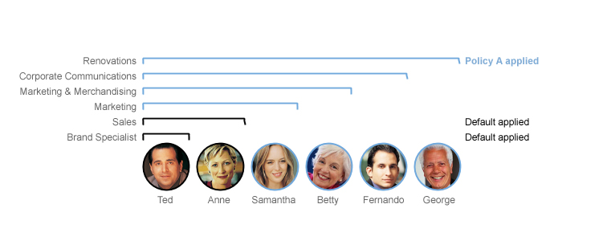
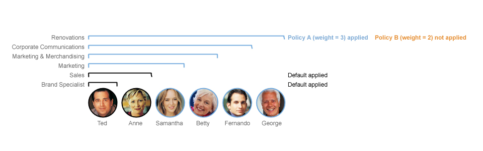

# Policy behaviors {#understandingpolicyimplementation .concept}

You can assign anonymous, default, or custom user policies to users or groups to allow or restrict access to certain Sametime features. Sametime uses policy weights and group nesting levels to determine which policies take precedence.

## Types of policies { .section}

Sametime automatically assigns two predefined policies, the anonymous user policy and the default user policy, and also supports the creation of custom user policies.

|Policy type|Description|
|-----------|-----------|
|Anonymous user policy|-   Users who have not authenticated are assigned the anonymous policy by default.
-   The anonymous policy cannot be deleted but can be edited if you want to allow or restrict access to certain Sametime features for unauthenticated users.
-   The anonymous policy always has the lowest policy weight \(0\) and this weight cannot be changed.

|
|Default user policy|-   Users who have authenticated are assigned the default policy if no other policy can be found for that user.
-   The default policy can be inherited or assigned.
-   The default policy cannot be deleted but can be edited if you want to allow or restrict access to certain Sametime features.
-   The default policy has the next lowest policy weight \(1\) after the anonymous policy and this weight cannot be changed.

|
|Custom user policies|-   Custom policies can be designed for specific users or groups to allow or restrict access to certain Sametime features.
-   When you create a new policy, the default policy settings are applied as the base settings of the new policy. You can update these settings.

|

## Policy weights { .section}

User policies in Sametime have weights that determine whether or not a policy's attributes take precedence over the attributes of other policies. Policies with a higher weight take precedence over those with a lower weight. You can change the weight of policies to control their order of precedence by moving them up and down within the policy list of a Sametime product. The policy weights of the anonymous and default policies, which are the lowest \(0\) and next-lowest \(1\) weights, cannot be changed.

For a user or group that is assigned two or more policies, Sametime implements the policy with the highest weight. For authenticated users, Sametime searches for an exact ID match, and then applies the highest weighted policy. If there is no match for the specific user ID in any policy, then Sametime applies the highest weighted group match. If no group matches are found, the default policy is applied.

Policies are only applied from the primary Sametime community. Additional server communities' policies are not pushed down to the users' desktops. A user's primary Sametime community is the first community listed in their Sametime Server Communities Properties settings.

## Policies applied to nested groups { .section}

You can configure how Sametime considers nested groups when it applies policies and how many levels deep that Sametime searches for the highest weighted group. By default, Sametime searches through four levels of nested groups when it determines the highest weighted policy. The maximum search depth limit is 10 levels and the minimum is -1 level \(no nesting\). If a policy is assigned to a group nested more than the current nesting depth, then the default policy is applied. If a group inherits a higher-level policy and is also assigned a policy directly, the directly assigned policy takes precedence over the inherited policy, regardless of either policy's weight.

**Note:** Entering a large number as the maximum nested group depth can have an impact on performance.

In the examples, the Renovations company has assigned employees to the following user groups; notice that many of the groups have other groups nested within them.

-   Renovations Group contains George and Corporate Communications Group
-   Corporate Communications Group contains Fernando and Marketing & Merchandising Group
-   Marketing & Merchandising Group contains Betty and Marketing Group
-   Marketing Group contains Samantha and Sales Group
-   Sales Group contains Anne and Brand Specialist Group
-   Brand Specialist Group contains Ted

The Renovations company has created some policies to control which user groups have access to different features in Sametime. The actual set of features available to each user will depend on how these policies are weighted and nested.

Example 1: Nested groups inherit policies

Policy A is assigned to Renovations Group. The nesting level is set to the default 4.

 George is assigned to Policy A because he belongs directly to the Renovations Group.

 Fernando is assigned to Policy A because his group falls within the group search nesting limit of 4 levels from the Renovations Group.

 Betty is assigned to Policy A because her group falls within the group search nesting limit of 4 levels from the Renovations Group.

 Samantha is assigned to Policy A because her group falls within the group search nesting limit of 4 levels from the Renovations Group.

 Anne is assigned to the default policy because her user group is nested more than the defined limit of 4 levels from the Renovations Group.

 Ted is assigned to the default policy because his user group is also nested more than the defined limit of 4 levels from the Renovations Group.

Example 2: Highest policy weight breaks ties

Policy A has a weight of 3 and is assigned to Renovations Group. Policy B has a weight of 2 and is also assigned to Renovations group. The nesting level is set to the default of 4.

 George is assigned to Policy A because he belongs directly to the Renovations Group and Policy A has a higher weight.

 Fernando is assigned to Policy A because his group falls within the group search nesting limit of 4 levels from the Renovations Group.

 Betty is assigned to Policy A because her group falls within the group search nesting limit of 4 levels from the Renovations Group.

 Samantha is assigned to Policy A because her group falls within the group search nesting limit of 4 levels from the Renovations Group.

 Anne is assigned to the default policy because her user group is nested more than the defined limit of 4 levels from the Renovations Group.

 Ted is assigned to the default policy because his user group is also nested more than the defined limit of 4 levels from the Renovations Group.

Example 3: Directly assigned policies have priority over inherited policies, regardless of weight

Policy A has a weight of 2 and is assigned to the Corporate Communications Group. Policy B has a weight of 3 and is assigned to the Renovations Group. The nesting level is set to the default of 4.

 George is assigned to Policy A because he belongs directly to the Renovations Group.

 Fernando is assigned to Policy A because he belongs directly to the Corporate Communications Group and Policy A has been directly assigned to the Corporate Communications Group.

 Betty is assigned to Policy A because her group falls within the group search nesting limit of 4 levels from the Corporate Communications Group.

 Samantha is assigned to Policy A because her group falls within the group search nesting limit of 4 levels from the Corporate Communications Group.

 Anne is assigned to Policy A because her groups falls within the group search nesting limit of 4 levels from the Corporate Communications Group.

 Ted is assigned to the default policy because his user group is nested more than the defined limit of 4 levels from both the Renovations Group and the Corporate Communications Group.

**Parent topic:**[Managing policies](managing_policies.md)

