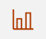

# Configuring Grafana on Docker and Podman {#adminui_grafana_config_docker .task}

-   Ensure that the following ports for the different monitoring services are open.
    -   Grafana: `3001`
    -   Prometheus: `9091`
    -   Pushgateway: `9092`
    -   Node-exporter: `9100`
    -   Cadvisor: `8088`
-   When applicable, ensure that the following services are accessible.

    -   Pushgateway: `http://host.docker.internal:9092`
    -   Proxy metrics: `http://host.docker.internal:8081/actuator/prometheus`
    -   Cadvisor: `http://host.docker.internal:8088/containers`
    **Note:** If using a local server, replace `host.docker.internal` with `localhost`.


You must have Grafana administrator privileges to configure the Sametime Grafana dashboard.

1.  Click the **Grafana icon** \(\) .

2.  Add Prometheus as the data source.

    In the Grafana dashboard, click **Home** \> **Connections** \> **Data sources** \> **Add new data source**. Locate and select**Prometheus**.

3.  Open the Prometheus data source and edit the settings. Under the **HTTP** section, enter the following URL.

    ``` {#codeblock_sjt_gy1_mvb}
    http://host.docker.internal:9091
    ```

4.  Select **Save and test**. A message is displayed to confirm if the data source is working.

5.  Upload the Docker\_Sametime\_Dashboard.json file. For more information, contact [HCL Customer Support](https://hclpnpsupport.hcltech.com/csm).

6.  Select **Prometheus \(default\)** as data source and then select **Import**.

7.  Save the dashboard.


**Parent Topic:  **[Monitoring your meeting and chat metrics with Grafana](adminui_grafana_overview.md)

