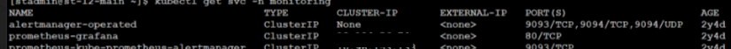

# Configuring Kubernetes to run Grafana {#adminui_grafana_config_kubernetes .task}

Grafana can be configured as a post-installation task or during an upgrade.

To use Granfana, the Prometheus application must be installed. If you installed Prometheus following the instructions in the [installation\_prometheus.md](installation_prometheus.md) topic, Grafana is installed as part of installing Prometheus.

To verify that the service was created correctly, run the following command to display a list of all services:

```
kubectl get svc -n monitoring
```

Ensure that the type for the Grafana is listed in the output as a service. Below is an example of the command output. 

1.  Edit the .env file and add the following statement.

    ``` {#codeblock_nv4_lvk_rzb}
    COMPOSE_PROFILES=monitoring
    ```

2.  Edit the custom.env file and add ensure that the following settings are set to true.

    ``` {#codeblock_h1v_rvk_rzb}
    ENABLE_GRAFANA_PROXY=true
    MONITORING_ENABLED=TRUE
    ```

3.  Edit the monitoring.env file and add the Grafana administrator ID and password.

    ``` {#codeblock_rsp_rvk_rzb}
    GF_SECURITY_ADMIN_USER
    GF_SECURITY_ADMIN_PASSWORD
    ```


