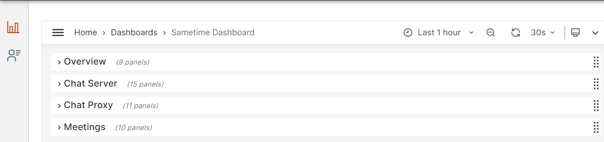

# Monitoring your meeting and chat metrics with Grafana {#adminui_grafana_overview .concept}

Sametime uses the third-party software, Grafana, to generate insightful graphs and visualizations derived from time-series database \(TSDB\) data. Integrating Grafana into your Sametime environment allows you to see analytic metrics about Sametime meetings and chats on a Grafana dashboard. The metrics can be used to monitor Sametime usage and resources.

Using Grafana involves that you have a running Grafana installation and then setting up the dashboard to view Sametime metrics. The Sametime Premium product image contains two JSON files that define Sametime metrics to display on the Grafana dashboard. One file is for a Docker environment and the other for Kubernetes. After you decompress the product image, the JSON files are located in the root folder. The files are:

-   Docker\_Sametime\_Dashboard.json
-   K8\_Sametime\_Dashboard.json

The Sametime Grafana dashboard consists of four rows, you can expand and contract each row.

Overview
:   Provides total number currently active chat sessions and logins, group chat sessions, active meetings, and meeting participants.

Chat Server
:   Provides details related to chats usage such as the number of chat server logins, CPU usage, sent and received network traffic and more.

Chat Proxy
:   Provides details about web and mobile client sessions, such as number of sessions, app usage, threads, and CPU usage, and more.

Meetings
:   Provides malformation about meetings, such as number of active and inactive meetings, largest meetings, memory usage and more.

If you have Grafana administrator access, you can customize the dashboard to generate additional or different metrics. Refer to the Grafana documentation on [Dashboards](https://grafana.com/docs/grafana/latest/dashboards/) for the details.

----

-   **[Configuring Grafana on Docker and Podman](adminui_grafana_config_docker.md)**  

-   **[Configuring Kubernetes to run Grafana](adminui_grafana_config_kubernetes.md)**  

 **Parent Topic:  **[Administering](administering.md)

