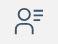

# Sametime Admin overview 

The Sametime Admin is a web access interface used to work with policies and analytic data related to Sametime Meetings and chat features.

Only those users with access privileges can access the Sametime Admin after logging into Sametime. The access URL is: `sametime\_server\_url/admin/`.

The Admin UI contains a left pane, with icons that allow for accessing features. Click the icons to go from one feature to another.

Granfana dashboard displays provided that your environment includes a Grafana integration. A Grafana integration allows you to view various analytic metrics about your Sametime deployment. The Grafana dashboard provides charts, graphs, and alerts about Sametime Meetings and Chat features. You can use a predefined Sametime dashboard or create one. For more information, see [Dashboards](https://grafana.com/docs/grafana/latest/dashboards/) in the Grafana documentation.

If your environment does not include a Grafana integration this page is empty. For additional information on using Grafana, see [adminui\_grafana\_overview.md](adminui_grafana_overview.md).

Manage Sametime polices used to control user access to Sametime features. You can create, assign, and view policy assignments, and more.

    See [adminui\_policy\_manage.md](adminui_policy_manage.md) for additional information.

## Admin UI access control

The administrator is defined during the installation process. You can change or modify the administrator by updating the following files.

-   `custom.env` file for Docker or Podman
-   `values.yaml` file for Kubernete or Openshift

