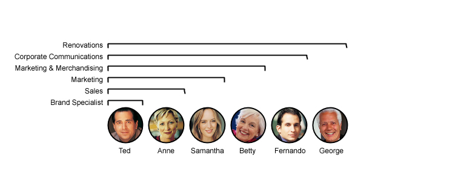
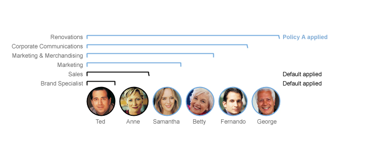
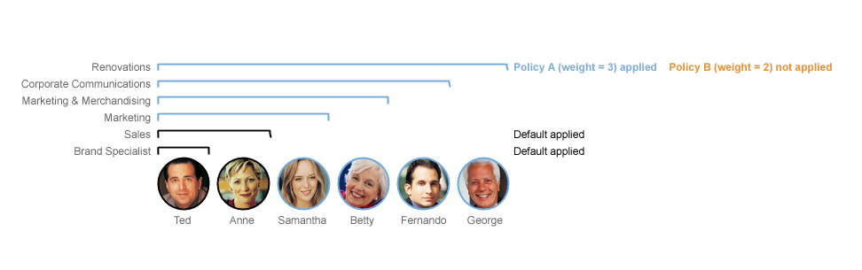
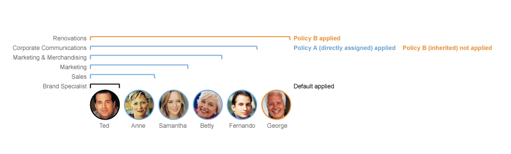

# Policy weight {#adminui_policy_weight .concept}

Policy weights and group nesting levels are used to determine which policies take precedence over the attributes of other policies.

Policies with a higher weight take precedence over those with a lower weight. You can change the weight of policies to control their order of precedence by moving them up and down within the policy list. The policy weights of the anonymous and default policies, which are the lowest \(0\) and next-lowest \(1\) weights, cannot be changed.

For a user or group that is assigned two or more policies, the policy with the highest weight is used. For authenticated users, Sametime searches for an exact ID match, and then applies the highest weighted policy.

-   If there is no match for the specific user ID in any policy, then Sametime applies the highest weighted group match.
-   If no group matches are found, the default policy is applied.

Policies are only applied from the primary Sametime community. Additional server communities' policies are not pushed down to the users' desktops. A user's primary Sametime community is the first community listed in their Sametime Server Communities Properties settings.

## Policies applied to nested groups { .section}

You can configure how Sametime considers nested groups when it applies policies and how many levels deep that are searched for the highest weighted group. By default, four levels of nested groups are searched when it determines the highest weighted policy. The maximum search depth limit is 10 levels and the minimum is -1 level \(no nesting\).

-   If a policy is assigned to a group nested more than the current nesting depth, then the default policy is applied.
-   If a group inherits a higher-level policy and is also assigned a policy directly, the directly assigned policy takes precedence over the inherited policy, regardless of either policy's weight.

**Note:** Entering a large number as the maximum nested group depth can have an impact on performance.

## Examples {#section_n5p_mcw_tyb .section}

In the following examples, the Renovations company has assigned employees to the following user groups. Notice that many of the groups have other groups nested within them.

|Group name|Members|
|----------|-------|
|Renovations Group|-   George
-   Corporate Communications Group

|
|Corporate Communications Group|-   Fernando
-   Marketing & Merchandising Group

|
|Marketing & Merchandising Group|-   Betty
-   Marketing Group

|
|Marketing Group|-   Samantha
-   Sales Group

|
|Sales Group|-   Anne
-   Brand Specialist Group

|
|Brand Specialist Group|Ted|

The Renovations company has created policies to control which user groups have access to different features in Sametime. The actual set of features available to each user depends on how these policies are weighted and nested.

## Nested groups inherit policies {#example_gdv_wdw_tyb .example}

Policy A is assigned to Renovations Group. The nesting level is set to the default 4.

 George is assigned to Policy A because he belongs directly to the Renovations Group.

 Fernando is assigned to Policy A because his group falls within the group search nesting limit of 4 levels from the Renovations Group.

 Betty is assigned to Policy A because her group falls within the group search nesting limit of 4 levels from the Renovations Group.

 Samantha is assigned to Policy A because her group falls within the group search nesting limit of 4 levels from the Renovations Group.

 Anne is assigned to the default policy because her user group is nested more than the defined limit of 4 levels from the Renovations Group.

 Ted is assigned to the default policy because his user group is also nested more than the defined limit of 4 levels from the Renovations Group.

## Highest policy weight breaks ties {#example_odv_wdw_tyb .example}

Policy A has a weight of 3 and is assigned to Renovations Group. Policy B has a weight of 2 and is also assigned to Renovations group. The nesting level is set to the default of 4.

 George is assigned to Policy A because he belongs directly to the Renovations Group and Policy A has a higher weight.

 Fernando is assigned to Policy A because his group falls within the group search nesting limit of 4 levels from the Renovations Group.

 Betty is assigned to Policy A because her group falls within the group search nesting limit of 4 levels from the Renovations Group.

 Samantha is assigned to Policy A because her group falls within the group search nesting limit of 4 levels from the Renovations Group.

 Anne is assigned to the default policy because her user group is nested more than the defined limit of 4 levels from the Renovations Group.

 Ted is assigned to the default policy because his user group is also nested more than the defined limit of 4 levels from the Renovations Group.

## Directly assigned policies have priority over inherited policies, regardless of weight {#example_wdv_wdw_tyb .example}

Policy A has a weight of 2 and is assigned to the Corporate Communications Group. Policy B has a weight of 3 and is assigned to the Renovations Group. The nesting level is set to the default of 4.

 George is assigned to Policy A because he belongs directly to the Renovations Group.

 Fernando is assigned to Policy A because he belongs directly to the Corporate Communications Group and Policy A has been directly assigned to the Corporate Communications Group.

 Betty is assigned to Policy A because her group falls within the group search nesting limit of 4 levels from the Corporate Communications Group.

 Samantha is assigned to Policy A because her group falls within the group search nesting limit of 4 levels from the Corporate Communications Group.

 Anne is assigned to Policy A because her groups falls within the group search nesting limit of 4 levels from the Corporate Communications Group.

 Ted is assigned to the default policy because his user group is nested more than the defined limit of 4 levels from both the Renovations Group and the Corporate Communications Group.

**Parent Topic: **[Managing policies](adminui_policy_manage.md)

