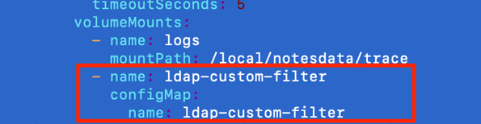

# Configuring the class file on Kubernetes {#config_class_file_kubernetes .task}

You can use a custom Java class file to transform your searches for LDAP for the community pod.

You must have already created and compiled the class file using Java 1.8.

To configure a custom Java class file to transform your searches for LDAP for the community pod in Kubernetes you need to complete the following tasks.

-   Create a ConfigMap with your compiled class file
-   Modify the community pod.yaml file to load the ConfigMap
-   Override the default LDAP settings to use the class file

The changes in this task affect the following pods:

-   community

1.  Create a configmap with your compiled class file.

    1.  Name the compiled class file StLdapCustomizedAttributes.class.

    2.  Create a folder on the machine where you run the kubectl commands called ldap-custom-filter.

    3.  Place the StLdapCustomizedAttributes.class file into the ldap-custom-filter folder.

    4.  Change directories to the ldap-custom-filter folder.

    5.  Run the following command to create a ConfigMap with the StLdapCustomizedAttributes.class within it.

        ``` {#codeblock_ftc_dwy_l5b}
        
        kubectl create configmap ldap-custom-filter --from-file=./ 
        ```

        **Note:** If you have a namespace dedicated to Sametime, add the -n argument with your namespace to ensure it is created in the correct namespace.

2.  Modify the pod.yaml file for the community pod to load the ConfigMap.

    1.  Use a text editor to open the file pod.yaml in the helm/charts/community/templates/ directory.

    2.  Locate the `volumeMounts:` section and under the first `mountPath,` statement create a new line and add the following stanza.

        ``` {#codeblock_cyr_2sc_mvb}
        
        - name: ldap-custom-filter 
        configMap: ldap-custom-filter
        name: 
        ```

    3.  Correct the indentation using only spaces so that the alignment of the new lines is the same as the lines above it. When finished it should look like the following:

        

    4.  Save and close the pod.yaml file.

3.  Override the default LDAP settings to use the class file.

    1.  Make a directory on your machine called extra-community-config at the root of where the Sametime installation package was decompressed.

    2.  Change to the extra-community-config directory.

    3.  Find the community pod name by running the get pods command. The pod name has some hashes in it, for example: `community-77d4695988-2bzrx):`.

        ``` {#codeblock_shv_5tw_fvb}
        kubectl get pods
        ```

    4.  Run the following command to pull a copy of the StCommunityConfig.xml file, specifying the name of the pod.

        ``` {#codeblock_ugr_ttw_fvb}
         kubectl exec -it pod\_name --container community -- cat /local/notesdata/StCommunityConfig.xml >./StCommunityConfig.xml 
        ```

    5.  Update the configuration that pertains to your custom Java class. Open the StCommunityConfig.xml file that was just copied to your machine. Then edit the `<LDAP>` section as it pertains to your configuration. The changes depend on what you are modifying, refer to the following table for guidance.

        |Type of change|Parameter name|What to specify|Example|
        |--------------|--------------|---------------|-------|
        |Search filter for resolving person names|PersonResolveFilter|classname.methodname\(\) for your custom code|`StLdapCustomized.peopleResolveFilter()`|
        |Search filter for resolving group names|GroupResolveFilter|Class name and method name for a group filter, using the following format: `Classname.methodname()`|`StLdapCustomized.groupsResolveFilter()`.|
        |Attribute of the person entry that defines the person's name|DescAttribute|Class name and method name for the formatting, with the name of the attribute inside, for example: Classname.methodname\(attribute\_name\)|`StLdapCustomizedAttributes.displayName(cn)`|

    6.  Save and close the StCommunityConfig.xml file.

    7.  Ensure you are in the extra-community-config directory that was created earlier then run the following command to create the secret.

        ``` {#codeblock_x4d_2qd_gvb}
         kubectl create secret generic extra-community-config --from-file=./ 
        ```

        **Note:** If you have a namespace dedicated to Sametime, add the -n argument with your namespace to ensure it is created in the correct namespace.

    8.  Change to the helm directory where the Sametime installation package was decompressed.

    9.  Open thevalues.yaml file and place in edit mode.

    10. Add the following line.

        ``` {#codeblock_qfm_kqd_gvb}
        overrideCommunityConfigSecret: extra-community-config
        ```

    11. Save and close the values.yaml file.

4.  Apply your changes to the environment.

    Verify that you are in the helm directory and run the following command to apply changes. Specify the Sametime deployment name for your environment. The default for Sametime Premium version 12 is sametime.

    ``` {#codeblock_iyn_51d_d5b}
    helm upgrade sametime\_deployment\_name .
    ```

    **Note:** Be sure to include the dot at the end. It is part of the command.

    If you are unsure of your deployment name, issue the helm list command to find the name. If you upgraded from an earlier Sametime release, the default name is sametime-meetings.

5.  Restart the pods with the changes. Use the kubectl scale command to scale the pods to zero and then to one that have been changed. You must run the commands for each pod that the change affects.

    1.  Run the following command to scale the pod to zero.

        Scale the pod to zero, where pod\_deployment\_name is the pod name.

        ``` {#codeblock_cwz_mwc_d5b}
        
        kubectl scale deploy pod\_deployment\_name --replicas=0
        
        ```

    2.  Run the following command to scale the pod to one.

        ``` {#codeblock_i2c_4wc_d5b}
        
        kubectl scale deploy pod\_deployment\_name --replicas=1
        ```


**Parent topic:**[Creating custom Java classes for searching LDAP](creating_custom_java.md)

