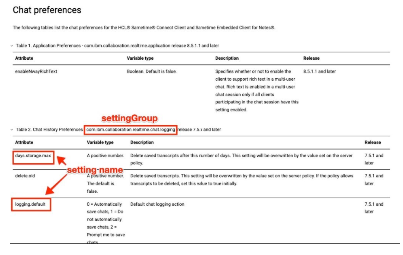
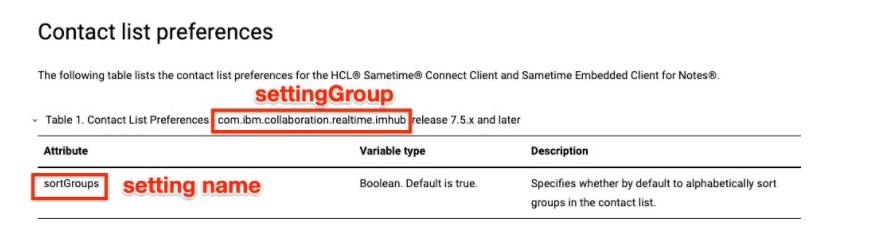

# Defining preferences in the managed-settings.xml file {#config_client_xml_file .task}

Follow these instructions to define preferences in a managed-settings.xml file.

All rules related to XML files apply. Additionally, the following items should be considered:

-   Do not create any extra blank lines in the file.
-   To use comments, precede the line with a hashtag \(\#\).
-   Do not use the tab key to indent lines, use two spaces instead.
-   Do not copy text from the help center and use it in your file because it may copy some of the encoding from the page and cause the file to fail.
-   It is helpful to use an XML editor, but a plain text editor can be used as well. If using a plain text editor, it is important to check the file extension when saving \(must be .xml not .txt\).

There is an example managed-settings.xml file attached to the [troubleshooting article](https://support.hcltechsw.com/csm?id=kb_article&sysparm_article=KB0038860) which can be used to test managed settings in place of creating a new one.

This procedure demonstrates how to create the managed-settings.xml and define chat history preferences for enabling automatically save chats for 7 days.

**Procedure**

1.  Create a new file with UTF-8 encoding named managed-settings.xml.

    **Note:** No other file names are supported.

2.  Place the opening and ending statements in the file:

    ```
    <?xml version="1.0"?> 
    
    <ManagedSettings> 
    
     
    
    </ManagedSettings>
    ```

    In between the `<ManagedSettings>` tags is where the settings must be defined. Thus the last line of the file should be `</ManagedSettings>`.

3.  [Review the settings](config_client_pref_tables.md) that can be defined. For this example, the [chat logging preferences](config_client_chat_history_pref.md) should be changed.

    **Note:** You can define other settings. This example is to only demonstrate the syntax.

4.  Place the `settingGroup` tags in between the <ManagedSettings\> tags.

    ```
    <?xml version="1.0"?> 
    
    <ManagedSettings> 
    
    <settingGroup name=""> 
    
     
    
    </settingGroup> 
    
    </ManagedSettings> 
    ```

5.  On the preferences documentation pages, some tables provide the names of the settingGroup. For example, [in the Chat Preferences](config_client_chat_history_pref.md), table 2 is for Chat History Preferences. The settingGroup name is com.ibm.collaboration.realtime.chat.logging. The settings that are used for this example are “days.storage.max” and “logging.default”. These configure the user’s client to automatically log all chats on the client-side and retain them for 7 days.

    

    Place the name of the settingGroup in the <settingGroup name=””\> tag.

    ```
    <?xml version="1.0"?> 
    
    <ManagedSettings> 
    
    <settingGroup name="com.ibm.collaboration.realtime.chat.logging"> 
    
     
    
    </settingGroup> 
    
    </ManagedSettings> 
    ```

6.  When you define the settings which are placed inside the settingGroup tags, there are several options. Refer to the table for the setting name.

    In the example from above, the two settings used in the example are “days.storage.max” and “logging.default”. These are defined in a tag called <setting name=”” value=””/\>. These lines are indented with two spaces.

    ```
    <?xml version="1.0"?> 
    
    <ManagedSettings> 
    
    <settingGroup name="com.ibm.collaboration.realtime.chat.logging"> 
    
      <setting name=”logging.default” value=”0”/> 
    
      <setting name=”days.storage.max” value=”7”/> 
    
    </settingGroup> 
    
    </ManagedSettings> 
    ```

    You can define settings from other settingGroups in the same file. Ensure that the formatting of spacing remains the same. For example, add a contact list preference to sort groups alphabetically by default. These settings are documented in the [Contact list preferences](config_client_contact_list_pref.md) topic.

    Open the help center topic and locate the settingGroup name.

    Locate the setting name.

    

    Add the new settingGroup and setting names below the first settingGroup.

    ```
    <?xml version="1.0"?> 
    
    <ManagedSettings> 
    
    <settingGroup name="com.ibm.collaboration.realtime.chat.logging"> 
    
      <setting name=”logging.default” value=”0”/> 
    
      <setting name=”days.storage.max” value=”7”/> 
    
    </settingGroup> 
    
    <settingGroup name="com.ibm.collaboration.realtime.imhub"> 
    
      <setting name=”sortGroups” value=”true”/> 
    
    </settingGroup> 
    
    </ManagedSettings> 
    ```

7.  Enable optional features.

    The `settingGroup` tag has an attribute called lastModDate which when present every change to a setting group must also be accompanied by a change to the lastModDate attribute or the new values are not updated. If you do not use the lastModDate attribute, the values are always updated, even if they are not new.

    The format for the lastModDate value uses `java.text.SimpleDateFormat` timestamp format. The syntax is

    ``` {#codeblock_mkb_fhp_jzb}
    YYYYMMDDThhmmss
    ```

    , where YYYY=year, MM=month, DD, hh=hours, mm=minutes, and ss=seconds. The values following the T are optional.

    For example:

    ```
    <?xml version="1.0"?> 
    
    <ManagedSettings> 
    
    <settingGroup name="com.ibm.collaboration.realtime.chat.logging" lastModDate=”2021-02-11T17:39:21-05”> 
    
      <setting name=”logging.default” value=”0”/> 
    
      <setting name=”days.storage.max” value=”7”/> 
    
    </settingGroup> 
    
    </ManagedSettings> 
    ```

    Each `<setting>` tag can have the following optional attributes:

    isLocked
    :   Boolean. The default value is *true*. If true, the setting is read-only and any changes that a user or application make to the value set by you, the administrator, are prevented or later overwritten. If this attribute is set to *false*, the administrator's setting is treated as a default value that can be changed by the user.

        ``` {#codeblock_i5l_5fp_jzb}
        <?xml version="1.0"?> 
        
        <ManagedSettings> 
        
        <settingGroup name="com.ibm.collaboration.realtime.chat.logging"> 
        
          <setting name=”logging.default” value=”0” isLocked=”false”/> 
        
          <setting name=”days.storage.max” value=”7” isLocked=”true”/> 
        
        </settingGroup> 
        
        </ManagedSettings> 
        ```

        In the above example, all chats are saved automatically initially until the user changes the setting, and the chat history is retained for 7 days. Users are not able to change this setting because it is locked.

    overwriteUnlocked
    :   Boolean. The default value is false. By default, a setting that is specified as being unlocked is treated as a default and would not overwrite any existing value on the client. This is to avoid undoing changes that the user might have legitimately made. However, if this setting is set to true, the unlocked value is overwritten with this new value even if it means clearing the user's existing value.

    overwriteUnlocked
    :   Boolean. The default value is false. By default, a setting that is specified as being unlocked is treated as a default and would not overwrite any existing value on the client. This is to avoid undoing changes that the user might have legitimately made. However, if this setting is set to true, the unlocked value is overwritten with this new value even if it means clearing the user's existing value.

    restartRequired
    :   Boolean. The default value is false. This attribute applies only when you automatically update client preferences with the managed-settings.xml file. Setting this to true creates a user prompt to restart the client as soon as the managed setting is applied. Use this optional attribute only if a restart of the client is required to activate the preference. The restart occurs only if the setting that includes this attribute is updated.

8.  Test the managed-settings.xml file for formatting errors. Open the file in a web browser and ensure that there are no syntax errors. If errors are present, edit the file and correct the syntax problem.


[Deploy managed-settings.xml or managed-community-configs.xml file to a web server](example_preferences.md).

-   **[Hosting client files for Sametime on Docker or Podman](example_preferences.md)**  
Sametime clients can be configured by administrators using a managed-settings.xml or managed-community-configs.xml file which is hosted by a web server. Additionally, the Sametime client can be pre-configured with settings such as the hostname, port, etc. The client package can be hosted on a web server for download. This topic has the steps to host files in the Sametime web container for Docker or Podman.
-   **[Hosting client files for Sametime on Kubernetes](t_example_preferences_2.md)**  
Sametime clients can be configured by administrators using a managed-settings.xml or managed-community-configs.xml file which is hosted by a web server. Additionally, the Sametime client can be pre-configured with settings such as the host name and port. The client package can be hosted on a web server for download.
-   **[Updating the client policy to include client preferences](update_client_policy.md)**  
After creating or updating the managed-settings.xml file and managed-community-configs.xml file to define client preferences, store them on a web server. The URL to the files is defined to the Sametime server throught a Sametime policy.

**Parent Topic: **[Updating client preferences with the managed-settings.xml file](config_client_xml_location.md)

