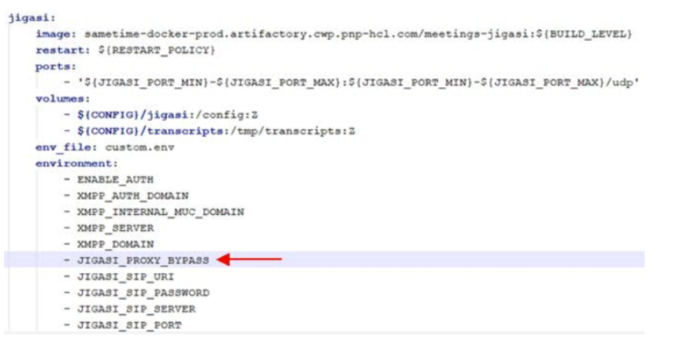
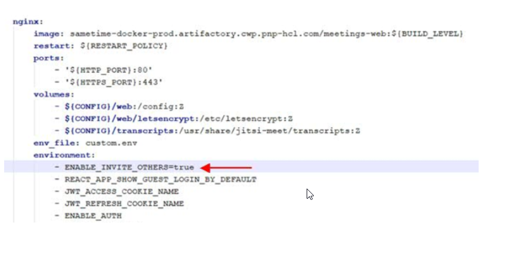
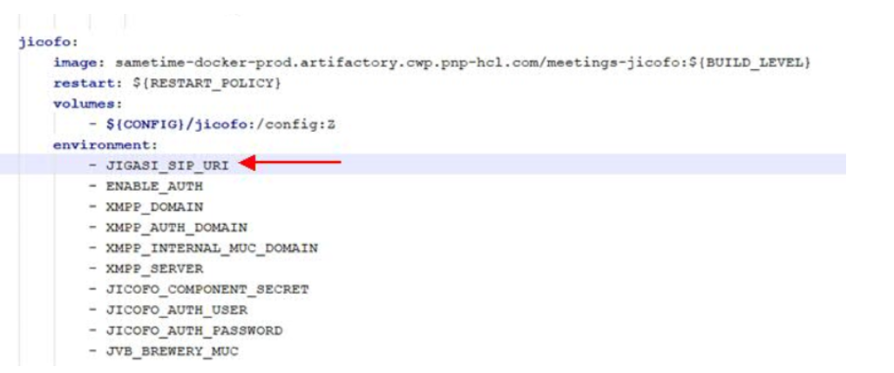

# Enabling meeting dial-out on Docker or Podman {#enable_dialout_docker .task}

The Docker and Podman commands are similar. The only difference is that docker precedes the command when issued in a Docker environment and podman precedes the name in a Podman environment. Example commands used in the Sametime documentation are shown using Docker. For Podman, change docker to podman.

1.  Edit the .env file and save the changes.

    Do not include the comments which are in parentheses \(\).

    ``` {#codeblock_cy2_2vy_mvb}
    JIGASI_SIP_SERVER=  (This is the SIP server/proxy IP or hostname. For hostname, this must be in DNS or added as extra_hosts entry in docker-compose.yml for the jigasi service.)
    
    JIGASI_SIP_PORT=5060  (This is the SIP server/proxy port)
    JIGASI_SIP_TRANSPORT=UDP  (This is SIP server/proxy protocol)
    JIGASI_SIP_URI= (This is the SIP URI, in plain text. Example: [mailto:mysipuser@mysipserver.com mysipuser@mysipserver.com] )
    JIGASI_SIP_PASSWORD= (This is the SIP user password, in plain text.)
    
    ```

2.  Edit the `docker_compose.yml` and save the changes.

    **Note:** The “-“ is required in front of the parameter.

    Under the JIGASI environment section, add the statement: `– JIGASI_PROXY_BYPASS`.

    

    Under NGINX environment section, add the statement: `- ENABLE_INVITE_OTHERS=true`.

    

    Under JICOFO environment section, add the statement: `- JIGASI_SIP_URI`.

    

3.  Apply the settings to Docker.

    To apply these settings to Docker, perform the following:

    ``` {#codeblock_hy2_2vy_mvb}
    cd to directory holding docker-compose.yml
    
    > docker-compose down
    > rm -rf sametime-config/jigasi
    > docker-compose up -d
    ```


**Parent Topic:  **[Enabling meeting dial-out](enable_dial_out.md)

