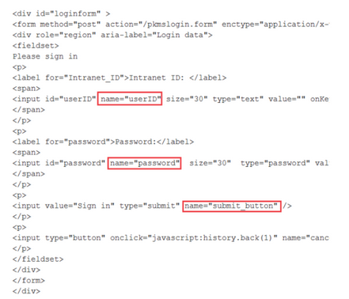

# Enabling SAML authentication in client installation packages {#enabling_saml .task}

Ensure that Sametime Connect and Embedded clients can connect to the Sametime using SAML by adding the new trusted audience URL to the client preferences before installing or updating the clients.

Enable SAML authentication for the deployment as explained in [Setting up SSO using SAML](enabling_sso_saml.md).

This task applies to the Sametime Connect and Embedded clients; it does not affect web or mobile clients. This topic includes parameters to pre-configure the clients for SAML, so that the users do not need to know any of the details.

During SAML log in process, Sametime redirects client connections to the Identity Provider \(IdP\) URL. If the IdP passes the user through multiple sites, Sametime stops loading the page and generates the following error message in the log: URL redirected\_url is not in the trusted sites list.

Ensure that Sametime Connect and Embedded clients can connect using SAML by adding the trusted site's URL to the client preferences before installing or updating the clients. This is the URL that you assigned in the STSAML\_TRUSTED\_AUDIENCES setting, as explained in [Configuration settings related to SAML authentication](configuring_sso_saml.md). For more information on configuring client installation packages, see [Configuring Sametime Connect client preferences with the Expeditor managed settings framework](config_client_mng_xml_pref.md).

Alternatively, users can manually enable SAML authentication by modifying settings in the client. For more information, see [Enabling SAML authentication in installed clients](enabling_saml_clients.md). This topic outlines the steps required to determine the settings used in the plugin\_customization.ini file. As you find the parameter name and value for each setting, save them in a temporary location, which is added to the plugin\_customization.ini to configure the clients.

1.  Determine the SAML prefix value.

    The Sametime clients support connecting to more than one Sametime environment, which could possibly have different IdPs. Therefore, the parameters defined in the plugin\_customization.ini file are prefixed with the host name of the server.

    To determine the parameter prefix value:

    -   The first part of the parameter prefix is `com.ibm.collaboration.realtime.community/`.
    -   The second part of the parameter prefix is the fully qualified host name of the Sametime server followed by a dot. For example:

        ``` {#codeblock_ejm_z5f_vyb}
        sametime.example.com.
        ```

    For example, if the Sametime host name is `sametime.example.com`, the resulting prefix using the example is the prefix added to each parameters.

    ```
    com.ibm.collaboration.realtime.community/sametime.example.com
    ```

    .

2.  Determine the IdP URL parameter name and value.

    To determine the parameter name, use the prefix determined in the previous step and append `idp=`. For example:

    ``` {#codeblock_hvn_qjl_lyb}
    com.ibm.collaboration.realtime.community/sametime.example.com.idp=
    ```

    Set the value of the parameter to the IdP URL. To find the IdP URL, refer to the [Setting up SSO using SAML](enabling_sso_saml.md). For example:

    ``` {#codeblock_zvc_zjl_lyb}
    com.ibm.collaboration.realtime.community/sametime.example.com.idp=https://idp.example.com/exampletenant&appid=1234?TARGET=https://sametime.example.com
    ```

3.  Determine if you should use a form based login or a browser based login type.

    The parameter name is the prefix determined in step one followed by idp.type= For example:

    ``` {#codeblock_hrc_ckl_lyb}
    com.ibm.collaboration.realtime.community/sametime.example.com.idp.type=
    ```

    The Sametime Connect and Embedded clients have two options for displaying the user login details:

    -   With the **Browser** option, the login window changes and displays the Identity Provider \(IdP\) login page when the log in is redirected to the IdP. This option should be used by most configurations.
    -   With the **Form** option, the user have a UI option that must include the form field values.
4.  If **Form** is selected as the login type, you must provide the names of the fields in the form. Skip this step if **Browser** is selected.

    Browse to your IdP URL, view the HTML source of the log-in form and collect the following values.

    prefix.idp.form.username.tag
    :   The value in the name attribute of the Intranet ID label's input statement. This value is user ID.

    prefix.idp.form.password.tag
    :   The value in the name attribute of the Password label's input statement. This value is password .

    prefix.idp.form.submit.tag
    :   The value in the name attribute of the Sign in input statement. This value is the submit tag.

    For example, if you browse to the example IdP URL, the following shows where the values appear in the sample HTML source. 

    Based on the example, the resulting settings and values are:

    ``` {#codeblock_kdg_btl_lyb}
     
    com.ibm.collaboration.realtime.community/sametime.example.com.idp.form.username.tag=userID 
    com.ibm.collaboration.realtime.community/sametime.example.com.idp.form.password.tag=password 
    com.ibm.collaboration.realtime.community/sametime.example.com.idp.form.submit.tag=submit_button 
    ```

5.  Set the samlTrustedSites parameter to list all redirecting URLs used by your IdP.

    Separate multiple URLs with a comma \(,\). If your IdP does not use redirecting URLs, leave this setting blank. Each URL can be as simple as https://host\_name, or you can include a path as in https://host\_name/path as shown in the following example.

    ``` {#codeblock_cf1_jtl_lyb}
     com.ibm.collaboration.realtime.community/samlTrustedSites=https://host1,https://host2/path
    ```

    **Note:** This parameter is scoped globally to Sametime and not to a particular community. If configuring multiple communities, enter all possible URLs.

6.  Configure the parameter that lists the communities which use SAML.

    Be sure to use the same fully qualified host name that was used in step 1 when the prefix was determined. For example:

    ``` {#codeblock_cls_rnp_kyb}
    
    com.ibm.collaboration.realtime.community/samlCommunities=sametime.example.com
    ```

    If you have more than one community supporting SAML, enter the second server name as well. Use a comma to separate values.

7.  Add the settings to the plugin\_customization.ini file and include it in the client package that is distributed to users.


**Parent Topic: **[Setting up SSO using SAML](enabling_sso_saml.md)

