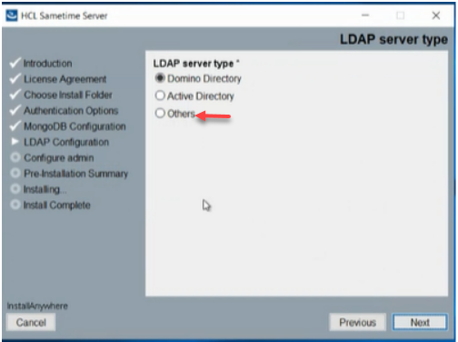

# Installing Sametime Chat on Windows

HCL Sametime Chat can be installed on a Windows OS.

## Before you begin

Download Sametime Chat to your local drive.

## Procedure
1.  From the location where you downloaded the Sametime Chat for Windows installer, click on the program to begin the installer.  
    

2.  Double-click on the HCL Sametime Server Installation program.  
   

3.  Select "yes" to allow changes.  
     
    
     
4. The Introduction to the Install Panel displays and Select **Next** to continue.  
    
     
5. The License Agreement panel displays.  Review the license agreement and Select **Next** to continue.              

6. The Choose Install Folder panel displays.  Accept the default path and choose one you prefer. Enter a folder name and Select **Next** to continue.    
      
 

7. The Authentication Panel displays. Enter the appropritate inforamtion and Select **Next**          
    - Inserting the IDP URL as provided by your SAML administrator
    - If you want to set up LTPA, then you can check the Configure LPTA box and Select **Next** to continue.

      **Note:**
         Sametime does not generate LTPA keys on the Windows machine. You can provide your existing LTPA keys   
     

8. The MongoDB Configuration panel displays o. See your MongoDB Admin for the required information and then Select **Next**.   
  

      **Note:**
         When you Select **Next** the information is validated, if you have entered incorrect information you can update as necessary and Select **Next** again until you receive notification that your information was validated.  
  
         

9.  The LDAP Configuration panel displays. Sametime supports any version 3.0, LDAP compliant server.

10.  Sametime has defaults for Domino and Active Directory defaults.  Because you want to be able to see the advanced information, select **others** to use open LDAP to view your host name.  Select **Next**.   

11. Select **Advanced LDAP Configuration** to specify settings for the Sametime server to access the your LDAP directory. Select **Next**  

12.  By choosing the Advaced LDAP Configuration setting you can now set the bind DN and password for the overall service.             
   

13.  Sample LDAP People and Group settings:  

14.  Enter the email address of the user that will be able to access the administration section in the Configure admin panel. This individual will be able to review policy work and look at monitoring and statistics. Select **Next**  

15. From the Pre-installation Summary panel you can review your submissions. Select **Next**   

16. The install will begin and you can track the install progress from the Installing HCL Sametime Server panel.  When the install completes Select **Next**  

17.  Launch and test your clients.   Select **Next**  

    
        
    
 