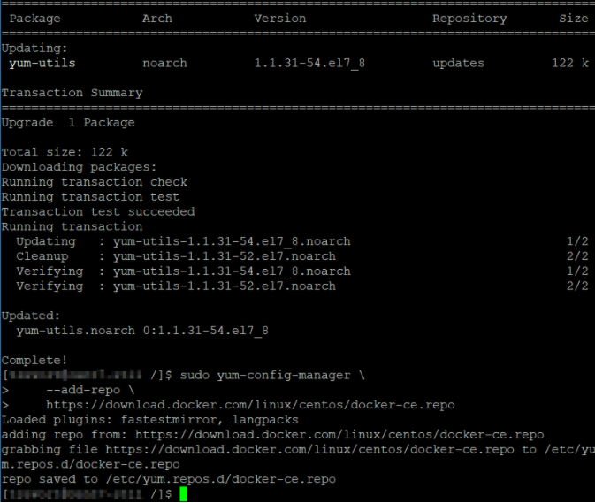
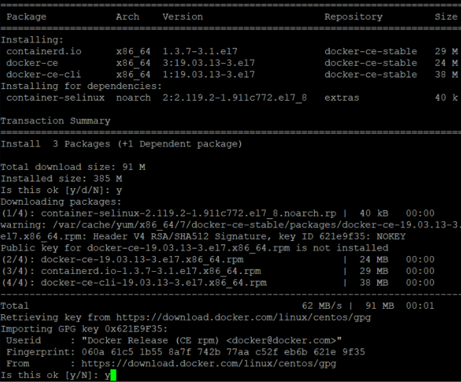
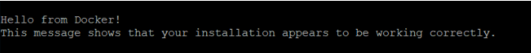
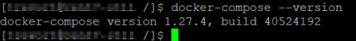
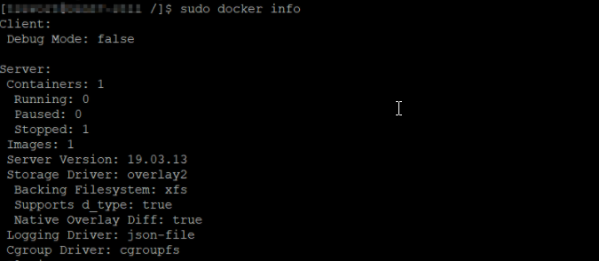

# Installing Docker {#installing_docker .task}

This section provides information on how to install Docker.

All commands provided require running as ROOT or SUDO access. If not running as root user, preface all commands with sudo.

1.  Before installing Docker Compose, make sure Docker Engine is installed either locally or remote, depending on the environment. On Linux systems, install the Docker Engine for your OS provided in [Install Docker Engine](https://docs.docker.com/engine/install/centos/) documentation. If you are following the Docker documentation to install the Docker Engine, docker compose must also be installed.

    The following is an example of the install Docker Engine on CentrOS based on Docker documentation to support docker compose commands used when installing Sametime. The example is for demonstration only.

    **Note:** CentOS ships with Docker installed, but not the most recent which is required. Install supported Docker version. See the [HCL Sametime® System Requirements](https://support.hcltechsw.com/csm?id=kb_article&sysparm_article=KB0100619) for details.

    1.  Uninstall old versions using the yum remove command provided in the Docker Engine documentation.

        

    2.  Install Docker Engine using a repository. First, install the yum-utils package which provides the yum-config-manager utility.

        ``` {#codeblock_lv4_psr_2tb}
        sudo yum install -y yum-utils 
        ```

        Then set up the stable repository.

        ``` {#codeblock_mv4_psr_2tb}
        sudo yum-config-manager \ 
            --add-repo \ 
        https://download.docker.com/linux/centos/docker-ce.repo
        ```

        

    3.  Install the latest version of Docker Engine and container.

        ``` {#codeblock_nv4_psr_2tb}
        yum install docker-ce docker-ce-cli containerd.io 
        ```

        

        

        At this point, Docker is installed but might not be started.

    4.  Start Docker.

        ``` {#codeblock_ov4_psr_2tb}
        systemctl start docker 
        ```

    5.  Verify that Docker Engine is installed correctly by running the hello-world image.

        ``` {#codeblock_pv4_psr_2tb}
        docker run hello-world 
        ```

        

    **Note:** If you right click links like [Install Docker Compose](https://docs.docker.com/compose/install/) and choose **Open link in Tab** you can complete these tasks and then close that tab to start the next step.

2.  Install Docker Compose following steps and commands provided in [Install Docker Compose](https://docs.docker.com/compose/install/) topic in the Docker documentation. Docker Compose 1.29 or higher is required.

    The following is an example of the install Docker Engine on CentrOS based on Docker documentation. The example is for demostration only.

    1.  Install Compose on Linux systems.

        ``` {#codeblock_rv4_psr_2tb}
        curl -L "https://github.com/docker/compose/releases/download/1.29.0/docker-compose-$(uname -s)-$(uname -m)" -o /usr/local/bin/docker-compose 
        
        ```

        

    2.  Apply executable permissions to the binary.

        ``` {#codeblock_sv4_psr_2tb}
        chmod +x /usr/local/bin/docker-compose 
        ```

    3.  Test the installation.

        ``` {#codeblock_tv4_psr_2tb}
        docker-compose --version 
        ```

        

3.  After the install is complete, use the following Linux shell command to confirm that Docker is running, which returns the docker information.

    ``` {#codeblock_uv4_psr_2tb}
    docker info
    ```

    

    If Docker is not running, an error message is displayed indicating that a connection to Docker cannot be completed.

    

    To start the Docker service, run the following command.

    ``` {#codeblock_vv4_psr_2tb}
    service docker start
    ```

    


**Parent topic:   **[Installing Sametime in a Docker or Podman environment](installation_sametime_docker.md)

