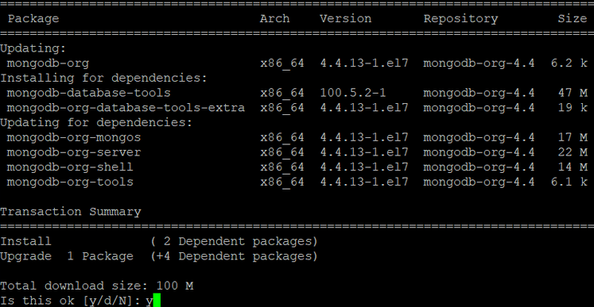
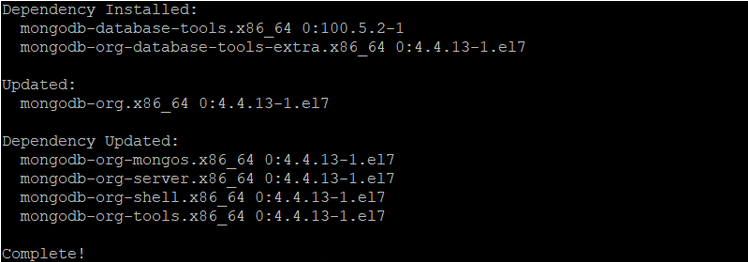
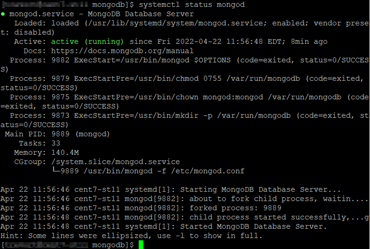

# Installing MongoDB on Linux {#installing_mongodb_linux .task}

MongoDB can be downloaded from the MongoDB website. This topic includes the steps for installing in CentOS and RHEL environments. For information on installing MongoDB on other operating systems, refer to [Install MongoDB](https://docs.mongodb.com/manual/installation/).

If you already have MongoDB installed and are upgrading to MongoDB 4.4 or to the latest patch release, see the [Upgrade to the Latest Revision of MongoDB](https://www.mongodb.com/docs/v6.0/tutorial/upgrade-revision/) document.

The commands used during the installation process require running as ROOT or SUDO access. If not running as root user, preface all commands with sudo.

**Note:** In the following steps, MongoDB version 6.0 is used as an example. If you are using a different version of MongoDB, refer to the MongoDB documentation for how to issue commands for the version that you are using.

1.  Create a repository file for YUM to install MongoDB. Use the VI command to create and edit the mongodb-org-4.4.repo file.

    ```
    
    cd /etc/yum.repos.d 
    vi mongodb-org-4.4.repo
    ```

    **Note:** The vi command is a screen-oriented text editor originally created for the Unix operating system.

2.  To edit the file, use Insert \(I\) and then copy and paste the following content:

    ``` {#codeblock_gsf_wq4_htb}
    
    [mongodb-org-6.0] 
    name=MongoDB Repository 
    baseurl=https://repo.mongodb.org/yum/redhat/$releasever/mongodb-org/6.0/x86_64/ 
    gpgcheck=1 
    enabled=1 
    gpgkey=https://www.mongodb.org/static/pgp/server-6.0.asc 
    
     
    ```

    **Note:** When copying and pasting, ensure to include all characters. The dash \(-\) in the `baseurl` can be removed in certain scenarios.

3.  Press **Esc** to exit insert mode.

4.  To save and exit, use the wq command. Precede the command with a colon \(:\).

    

    If you receive a E212: Can’t open file for writing error message, it means that a root user is not being used or sudo access is being used.

    

    If the repo URL is not available, manually download and install the rpm files. You can download the files from the [Index of RPMS](https://repo.mongodb.org/yum/redhat/7/mongodb-org/4.4/x86_64/RPMS) download page. For example:

    ``` {#codeblock_ex3_jpm_htb}
    
    mongodb-database-tools-100.5.1.x86_64.rpm  
    mongodb-org-shell-4.4.9-1.el7.x86_64.rpm  
    mongodb-org-tools-4.4.9-1.el7.x86_64.rpm  
    mongodb-org-server-4.4.9-1.el7.x86_64.rpm  
    mongodb-org-mongos-4.4.9-1.el7.x86_64.rpm  
    mongodb-org-database-tools-extra-4.4.9-1.el7.x86_64.rpm  
    mongodb-org-4.4.9-1.el7.x86_64.rpm
    ```

    After the download completes, install:

    ``` {#codeblock_fbz_lms_3tb}
    
    yum localinstall mongodb-database-tools-100.5.1.x86_64.rpm -y  
    yum localinstall -y mongodb-org-database-tools-extra-4.4.9-1.el7.x86_64.rpm  
    yum localinstall -y mongodb-org-4.4.9-1.el7.x86_64.rpm mongodb-org-mongos-4.4.9-1.el7.x86_64.rpm mongodb-org-server-4.4.9-1.el7.x86_64.rpm mongodb-org-shell-4.4.9-1.el7.x86_64.rpm mongodb-org-tools-4.4.9-1.el7.x86_64.rpm -y 
    ```

5.  Execute YUM to install the MongoDB package.

    ``` {#codeblock_ebb_1qm_htb}
    yum install mongodb-org 
    ```

    1.  Type y to confirm the download size.

        

    2.  Type y to accept the GPG key import.

        

    3.  A Complete! message is displayed when the installation process is finished.

        

6.  Verify that the MongoDB components, user, default log, and data directories are created by checking if the following directories exist and are owned by mongod.

    -   /var/log/mongodb

        

    -   /var/lib/mongo

        

7.  To start the MongoDB server, enter the command:

    ``` {#codeblock_ryl_krm_htb}
    service mongod start
    ```

    To stop the MongoDB server, enter the command:

    ``` {#codeblock_syl_krm_htb}
    service mongod stop
    ```

    To verify the status of the MongoDB service, enter the command:

    ``` {#codeblock_tyl_krm_htb}
    systemctl status mongod
    ```

    


[Set up a replica set with keyfile access control](t_create_mongo_replset.md)

**Parent Topic:  **[Installing MongoDB](installation_mongodb.md)

