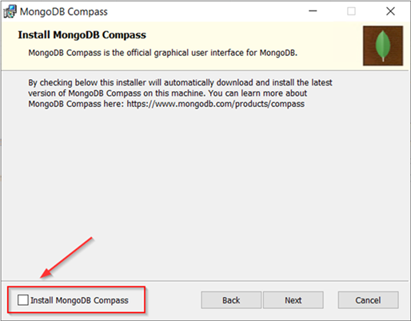
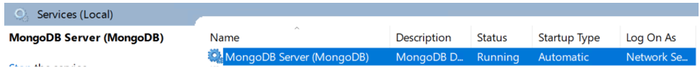

# Installing MongoDB on Windows {#installing_mongodb_windows .task}

MongoDB can be downloaded from the MongoDB website. This topic guides you through the steps for installing MongoDB on Windows.

For additonal information on installing MongoDB on Windows, refer to [Install MongoDB Community Edition on Windows](https://www.mongodb.com/docs/manual/tutorial/install-mongodb-on-windows/) tutorial.

**Note:** In the following steps, MongoDB version 4.4 is used as an example. If you are using a different version of MongoDB, refer to the MongoDB documentation for how to issue commands for the version that you are using.

1.  Download the latest MongoDB version from the MongoDB download page.

    Click this link to access the download page: [Download MongoDB Community Server](https://www.mongodb.com/download-center/community).

2.  In the **Available Download** section, select the version to download.

    1.  From the **Platform** field, select **Windows**

    2.  From the **Package** field, select**msi**.

        You'll have the option to download a msi or zip file.

    3.  Click **Download**.

3.  Navigate to the folder where MongoDB installation file was downloaded and double click the msi file.

    This starts the install process.

4.  Follow the MongoDB Setup Wizard to complete the install.

    Click **Next** to view the license agreement. To continue accept the license and click **Next**.

5.  On the Choose Setup Type window, click **Complete**.

6.  On the Service Configuration window, specify the following options and then click **Next**.

    -   Check **Install MongoDB as a Service**. It is required to run MongDB as a Windows service.
    -   Enable **Run service as Network Service user**.
    -   You can use the default values for **Service**,**Data Directory**, and **Log Directory**. If you modify these values, be sure to keep a note of the values. They are needed for the configuration steps.
    

7.  Install MongoDB Compass is optional and not required for deploying HCL Sametime. Clear the checkbox for **Install MongoDB Compass** and click **Next**.

    

    If MongoDB Compass is installed, it starts after after the install process completes. You can shutdown the MongoDB Compass application, as it is not used for HCL Sametime deployments.

8.  Click **Install** to complete the MongoDB installation.

    During the install process, you might be prompted about files that cannot be updated while the system is running. You can choose to continue and manually restart the computer later.

    After the install process completes, you must restart your computer.

9.  When athe install process is compete, click **Finish**.

10. After the system restart, MongoDB is running as a Windows service.

    

11. Verify that MongoDB installed successfully by opening the MongoDB Console. To open the console, navigate to the MongoDB installation directory and locate the bin directory. For example: C:\\Program Files\\MongoDB\\Server\\4.4\\bin. Start the mongo application.

    To close the console, type Exit on the command line.

[Configure MongoDB for HCL Sametime](t_configure_mongodb.md)

**Parent topic:**[Installing the MongoDB](installation_mongodb.md)

