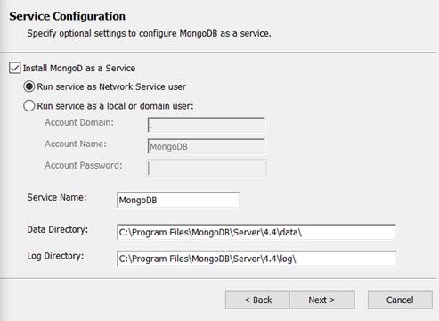

# Installing MongoDB on Windows {#installing_mongodb_windows .task}

MongoDB can be downloaded from the MongoDB website. This topic guides you through the steps for installing MongoDB on Windows.

For additional information on installing MongoDB on Windows, refer to [Install MongoDB Community Edition on Windows](https://www.mongodb.com/docs/manual/tutorial/install-mongodb-on-windows/).

**Note:** In the following steps, MongoDB version 4.4 is used as an example. If you are using a different version of MongoDB, refer to the MongoDB documentation for instructions on how to issue commands for the version that you are using.

1.  Download the latest MongoDB version from the [Download MongoDB Community Server](https://www.mongodb.com/download-center/community) page.

2.  In the **Available Download** section, select the version to download.

    1.  From the **Platform** field, select **Windows**.

    2.  From the **Package** field, select**msi**. You have the option to download a msi or zip file.

    3.  Select **Download**.

3.  Navigate to the folder where the MongoDB installation file was downloaded and run the msi file. This starts the installation process.

4.  Follow the MongoDB Setup Wizard to complete the install. Select **Next** to view the license agreement. To continue, accept the license and select **Next**.

5.  On the Choose Setup Type window, select **Complete**.

6.  On the Service Configuration window, specify the following options and then select **Next**.

    -   Check **Install MongoDB as a Service**. It is required to run MongoDB as a Windows service.
    -   Enable **Run service as Network Service user**.
    -   You can use the default values for **Service**, **Data Directory**, and **Log Directory**. If you modify these values, save or record the values. They are needed for the configuration steps.
    

7.  Installing MongoDB Compass is optional and not required for deploying Sametime. Clear the checkbox for **Install MongoDB Compass**and select **Next**.

    

    If MongoDB Compass is installed, it starts after the installation process completes. You can shut down the MongoDB Compass application, as it is not used for Sametime deployments.

8.  Select **Install** to complete the MongoDB installation. During the installation process, you might be prompted about files that cannot be updated while the system is running. You can choose to continue and manually restart the computer later.

    After the install process completes, you must restart your computer.

    

9.  When the installation process is complete, select **Finish**.

10. After the system restart, MongoDB automatically runs as a Windows service.

    

11. Verify that MongoDB installed successfully by opening the MongoDB console. To open the console, navigate to the MongoDB installation directory and locate the bin directory. For example: C:\\Program Files\\MongoDB\\Server\\4.4\\bin. Start the mongo application.

    To close the console, type Exit on the command line.

    

[Set up a replica set with keyfile access control](t_create_mongo_replset.md)

**Parent Topic: **[Installing MongoDB](installation_mongodb.md)

