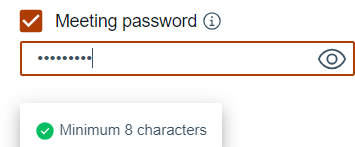

# Defining Meetings password requirements {#meetings_passwords .task}

The default requirement for a meeting is that the password must be at least eight characters. To increase the password requirements, additional rules can be specified.

A meeting owner can define a meeting password when creating a meeting. When a meeting participant logs into the meeting and the password rules are displayed as the password is typed. As a requirement is met, a green circle with a check mark is displayed next to the requirement.



You can set one or more of the following rules to increase password strength.

-   Password length. The default value is 8.
-   Include at least one special characters. The default is no special characters are needed. The special characters are: -\#!$@£%^&\*\(\)\_+\|~=\`\{\}\[\]:\\";'<\>?,./ ",
-   Include at least one uppercase letter. The default is false.
-   Include at least one lowercase letter. The default is false.
-   Include at least one number. The default is false.

1.  Edit one of the followiong files.

    -   For Docker, .env
    -   For Kubernetes, values.yaml
2.  Locate and update the following parameters.

    -   Docker

        ``` {#codeblock_zmy_rhm_lzb}
        REACT_APP_PASSWORD_MIN_LENGTH=password\_length
        REACT_APP_PASSWORD_SPECIAL_CHARS_REQUIRED=false
        REACT_APP_PASSWORD_UPPER_CASE_REQUIRED=false
        REACT_APP_PASSWORD_LOWER_CASE_REQUIRED=false
        REACT_APP_PASSWORD_DIGITS_REQUIRED=false
        ```

    -   Kubernetes

        ``` {#codeblock_vb5_shm_lzb}
        passwordMinLengthRequired: password\_length
          passwordSpecialCharsRequired: false
          passwordUpperCaseRequired: false
          passwordLowerCaseRequired: false
          passwordDigitsRequired: false
        ```

3.  Restart the Sametime server to apply the changes. For more information, refer to [Starting and stopping servers](https://help.hcltechsw.com/sametime/12/admin/starting_and_stopping_servers.html).


**Parent Topic: **[Managing Sametime Meetings](sametime_meeting_administering.md)

