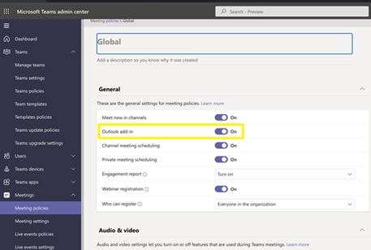

# Deploying Microsoft Outlook add-ins to users 

Duplicate meeting details are added to calendar events when using Microsoft Teams.

Microsoft Teams automatically adds meeting details to a calendar regardless of whether Sametime meeting details already exist in the calendar event.

This issue can be resolved by doing one of the following:

-   Remove the MicroSoft Teams integration in Outlook
-   Configure user mailboxes in Microsoft Exchange to not enable online meetings by default

The Microsoft Outlook add-in policy controls whether Teams meetings can be scheduled within Outlook. For additional information, see [Meeting policy settings - General](https://learn.microsoft.com/en-us/microsoftteams/meeting-policies-in-teams-general#outlook-add-in). To turn off Teams meeting scheduling, open the Teams admin center to the Meetings policy window. Locate the **Outlook add-in** policy and turn it off. When finished, scroll to the bottom of the window and click **Save**.

**Note:** The change can take up to twenty-four hours to take effect and the Outlook click must be started again to include the change.



The other method is to configure user mailboxes in Microsoft Exchange to not enable online meetings by default. Follow instructions from Microsoft for installing and connecting the Exchange Online PowerShell V2 module. See [Connect to Exchange Online PowerShell](https://docs.microsoft.com/en-us/powershell/exchange/connect-to-exchange-online-powershell?view=exchange-ps&viewFallbackFrom=o365-worldwide).

Connect EXO with Connect-ExchangeOnline -UserPrincipalName user@domain.com or other examples in above link.

Review the documentation for the related configuration:

-   [Set-OrganizationConfig](https://docs.microsoft.com/en-us/powershell/module/exchange/set-organizationconfig?view=exchange-ps#:~:text=2019%2C%20Exchange%20Online-,%2DOnlineMeetingsByDefaultEnabled,-This%20parameter%20is)
-   [Set-MailboxCalendarConfiguration](https://docs.microsoft.com/en-us/powershell/module/exchange/set-mailboxcalendarconfiguration?view=exchange-ps#:~:text=Exchange%20Online-,%2DOnlineMeetingsByDefaultEnabled,-This%20parameter%20is)

You can set this configuration an organization level:

``` {#codeblock_t31_v1v_tvb}
Set-OrganizationConfig -OnlineMeetingsByDefaultEnabled $False
```

Review organization configuration with:

``` {#codeblock_l4q_nky_5vb}
Get-OrganizationConfig 
```

Alternately, you can set the configuration on a single mailbox by replacing user@domain.com with the target mailbox email:

``` {#codeblock_ucl_gly_5vb}
Get-Mailbox -Identity user@domain.com | Set-MailboxCalendarConfiguration -OnlineMeetingsByDefaultEnabled $False
```

Review the mailbox config with:

``` {#codeblock_wrk_3ly_5vb}
Get-MailboxCalendarConfiguration -Identity user@domain.com | Format-List
```

**Parent Topic:  **[Troubleshooting Sametime Meetings](t_troubleshooting_sametime_meetings.md)

