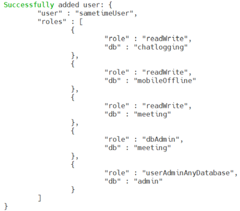

# Configuring MongoDB for Sametime {#configure_mongodb .task}

This topic describes how to configure MongoDB on both Windows and Linux platforms to support Sametime and Sametime Premium deployments.

MongoDB security is enabled by default. Securing MongoDB is not required for Sametime but provides the best results.

**Note:** In the following steps, MongoDB version 6.0 is used as an example. If you are using a different version of MongoDB, refer to the [official MongoDB documentation](https://www.mongodb.com/docs/manual/tutorial/deploy-replica-set-with-keyfile-access-control/) for how to issue commands for the version that you are using.

1.  Access the Mongo Shell on the Primary node of the MongoDB cluster.

2.  Run the db.createUser\(\)method to add the user administrator. The following example creates the user sametimeAdmin with the userAdminAnyDatabase role on the admin database.

    ``` {#codeblock_qnx_phs_nyb}
    admin = db.getSiblingDB("admin")
    admin.createUser(
      {
        user: "sametimeAdmin",
        pwd: "sametime", // or cleartext password
        roles: [ { role: "userAdminAnyDatabase", db: "admin"}, {role:"readWrite", db:"chatlogging"}, {role:"dbAdmin",db:"chatlogging"}, {role:"readWrite", db:"mobileOffline"}, {role:"dbAdmin", db:"mobileOffline"}, { role:"readWrite", db:"meeting"}, {role:"dbAdmin", db:"meeting"}, { role:"readWrite", db:"privacy"}, {role:"dbAdmin", db:"privacy"}, { role:"readWrite", db:"userinfo"}, {role:"dbAdmin", db:"userinfo"} ]})
    ```

    Ensure that passwords are random, long, and complex to prevent security breaches.

    **Note:** As previously mentioned, the localhost exception becomes unavailable *after* the first user is created. Ensure that the first user has the authority to create more users. Failure to do so could mean being unable to create or modify users with new privileges when you close the localhost exception.

3.  From mongosh, run the db.auth\(\)method to authenticate as the user administrator.

    ``` {#codeblock_yrl_v3s_nyb}
    db.getSiblingDB("admin").auth("sametimeAdmin", "sametime") // or cleartext password
    ```

4.  Run the db.createUser\(\)method to add the cluster administrator. The following example creates the user sametimeClusterAdmin with the clusterAdmin role on the admin database.

    ``` {#codeblock_dhp_jks_nyb}
    db.getSiblingDB("admin").createUser( 
    
      { 
    
        "user" : "sametimeClusterAdmin", 
    
        "pwd" : "sametime",      
    
        roles: [ { "role" : "clusterAdmin", "db" : "admin" } ] 
    
      } 
    
    ) 
    ```

    The following screen is displayed when the commands are completed successfully.

    

5.  Optional: Create additional users by repeating steps 1–4 as required for your installation.

6.  From the MongoDB console, run the following commands to create the chatloggingdatabase with events and sessions collections in MongoDB.

    ``` {#codeblock_zmb_sls_nyb}
    use chatlogging      
    
    db.EVENTS.insertOne({"_id" : "dummy"}) 
    
    db.SESSIONS.insertOne({"_id" : "dummy"}) 
    ```

    **Note:** The commands are case-sensitive and must be typed as shown.


After the MongoDB is configured, you can install Sametime. Refer to [Installing Sametime](installation_sametime.md) for the details.

**Parent Topic:  **[Installing MongoDB](installation_mongodb.md)

