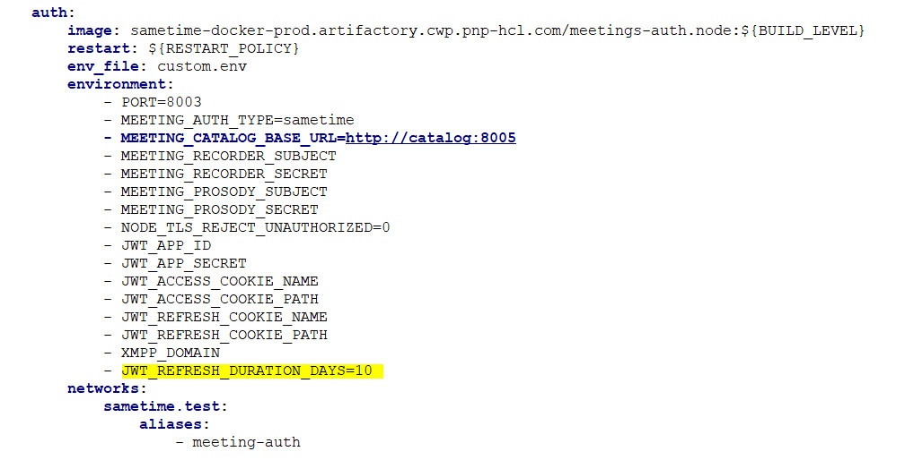

# Managing user sign-on on Docker or Podman {#t_manage_user_login_docker .task}

A token is maintained by the Sametime server to control how often you sign in. The default value is 30 days. You can modify this value or turn off the feature by including the `JWT_REFRESH_DURATION_DAYS` environment variable in the YAML file. You can specify any number of whole days to retain login credentials. To disable this feature, set the value to 0.

When you modify the docker-compose.yml file, follow the syntax rules for YAML files to prevent coding errors. When you modify the YAML file, the indentations of entries are spaces, not tab characters.

1.  Edit the docker-compose.yml file and locate the auth section within the file.

    The file is in the root directory.

2.  Add the `JWT_REFRESH_DURATION_DAYS` environment variable.

    Specify the duration in this format:

    ``` {#codeblock_ztj_kmn_cxb}
    JWT_REFRESH_DURATION_DAYS=number\_of\_days
    ```

    The following example shows the auth section with the `JWT_REFRESH_DURATION_DAYS` environment variable set to 10 days. 

3.  Save the changes.

4.  Start the Sametime server to apply the changes.

    ``` {#codeblock_btc_lj4_k5b}
    docker compose up -d
    
    ```


**Parent Topic: **[Managing user sign-on](control_validity_length.md)

