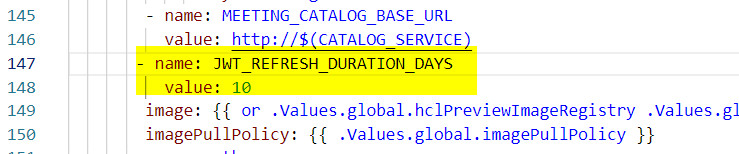

# Managing user sign-on on Kubernetes {#t_manage_user_login_k8s .task}

A token is maintained by the Sametime server to control how often you sign in. The default value is 30 days. You can modify this value or turn off the feature by adding the `JWT_REFRESH_DURATION_DAYS` environment variable. You can specify any number of whole days to retain login credentials. To disable this feature, set the value to 0.

You can change settings temporarily or permanently. To temporarily change the setting, run the following command to change the setting in a deployed environment.

``` {#codeblock_h4q_nmn_cxb}
kubectl set env deploy/auth JWT_REFRESH_DURATION_DAYS=number\_of\_days
```

To permanently change the setting, complete the following steps:

1.  Edit the deployment.yaml file, which contains the auth environment variables.

    You can find the file in the helm/charts/auth/templates directory.

2.  Add the `JWT_REFRESH_DURATION_DAYS` environment variable.

    Specify the duration in this format:

    ``` {#codeblock_j4q_nmn_cxb}
    name: JWT_REFRESH_DURATION_DAYS value: number\_of\_days
    
    ```

    The following example shows the auth section with the JWT\_REFRESH\_DURATION\_DAYS environment variable set to 10 days.

    

3.  Save the changes.

4.  Perform a helm upgrade to deploy the updated chart.


**Parent Topic: **[Managing user sign-on](control_validity_length.md)

