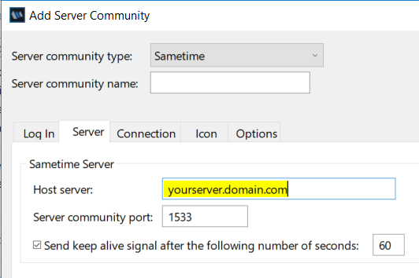
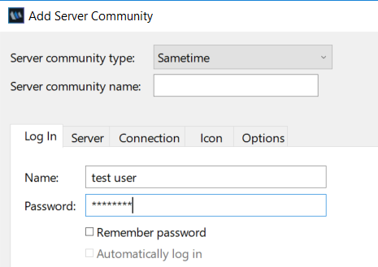

# Testing Sametime chat and meeting clients {#t_testing_sametime_chat .task}

This article assumes that you have successfully installed and configured Sametime or Sametime Premium.

Before going live, it is important to test the following services to ensure that Sametime is working as expected.

1.  Verify if the Sametime web client chat is running. Using a web browser, go to the URL:

    ``` {#codeblock_onz_dn2_htb}
    https://yourserver.domain.com/chat
    ```

    The `yourserver.domain` variable is the name of your Sametime server and the domain name.

2.  Verify if the Sametime server is running. Using a web browser, go to the following URL:

    ``` {#codeblock_pf2_hcf_htb}
    https://yourserver.domain.com 
    https://yourserver.domain.com/meeting
    ```

3.  Verify if the Sametime Connect client and Sametime embedded client \(in HCL Notes\) are running.

    1.  Add a Sametime Server Community under Preferences specifying the Host server and Server community port.

        The default Server community port value is `1533`.

    2.  Enter a username and password on the Log In tab.

        

    3.  Select **OK** to save the changes.

    4.  Log in using the new credentials.


**Parent topic:**[Administering](administering.md)

