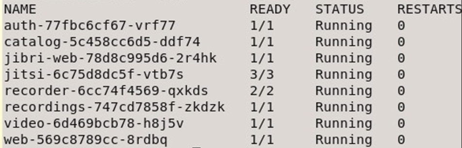

# Kubernetes: Containers not starting due to "Host not found" {#t_troubleshooting_kubernetes_host_not_found .task}

Use this information on troubleshooting Sametime 12 Premium on Kubernetes - containers not starting due to "Host not found."

After installing Sametime 12, the server is not responding correctly. You may experience any of the following symptoms:

-   Unable to create or save a meeting room
-   Can't get a list of meeting rooms
-   Recordings fail
-   Unable to login
-   Group chat inside the meeting fails
-   Media streams do not work

To investigate the issue, use the command:

``` {#codeblock_xdj_cb1_ptb}
kubectl get po
```

This will display a list of the processes \(pods\) running. In a normal working environment, you'll see all of the processes with status "running".



If any of your processes in this list are not "Running" it indicates a problem. Typically with the problems described above it indicates an issue with the meeting server connecting to MongoDB or the Sametime Proxy. To further investigate these two areas you'll take the name of the process as it is in the name column. For storage related issues \(creating/retrieving meeting rooms\), it is the catalog process. Run the below commands to further investigate.

``` {#codeblock_ydj_cb1_ptb}
kubectl describe catalog
```

For authentication issues, investigate the "auth" process.

``` {#codeblock_zdj_cb1_ptb}
kubectl logs <auth-name> 
```

For example using the screenshot above the auth process name is auth-77fbc6cf67-vrf77, then the command is:

``` {#codeblock_a2j_cb1_ptb}
kubectl logs auth-77fbc6cf67-vrf77
```

For recordings, investigate the "recordings" process.

``` {#codeblock_b2j_cb1_ptb}
kubectl logs <recordings-name>
```

For other Sametime Proxy related issues, investigate the "web" process.

``` {#codeblock_c2j_cb1_ptb}
kubectl logs <web-name>
```

For media issues, investigate the "video" process.

``` {#codeblock_d2j_cb1_ptb}
kubectl logs deploy/video
```

If you see errors about "host not found" then the Kubernetes environment is having difficulty resolving the MongoDB server and/or Proxy server.

**Resolution**

If the DNS is unable to consistently resolve the host names for MongoDB and/or Sametime Proxy, these hostnames and IP addresses can be added to the configuration manually. In Kubernetes you can add these hostnames and the IP addresses to the host aliases. For further reading on this feature see: [Adding entries to Pod /etc/hosts with HostAliases](https://kubernetes.io/docs/concepts/services-networking/add-entries-to-pod-etc-hosts-with-host-aliases/).

Each pod that is producing a "host not found" error message will need to have the host aliases updated.

You can modify the template, so that any future changes that you wish to incorporate will bring these host aliases. Or you can also modify the instance that is running, so that the change will be in effect immediately.

**Note:** If you modify the instance that is running, you will lose these settings if you restart the pod. It is recommended to change the template.

1.  Use the below table to determine which template needs to be modified. Also the command to modify the running instance is provided.

    |Name to resolve|Pod|Template name\(s\)|Command to modify running instance.|
    |---------------|---|------------------|-----------------------------------|
    |Hostname of the Sametime Proxy|auth and web pods|helm/charts/web/templates/deployment.yaml

 helm/charts/auth/templates/deployment.yaml

|    ``` {#codeblock_f2j_cb1_ptb}
kubectl edit deploy web
    ```

     ``` {#codeblock_g2j_cb1_ptb}
kubectl edit deploy auth
    ```

|
    |Hostname of the MongoDB server|catalog|helm/charts/catalog/templates/deployment.yaml|    ``` {#codeblock_h2j_cb1_ptb}
kubectl edit deply catalog
    ```

|
    |STUN server host|video|helm/charts/video/templates/deployment.yaml|    ``` {#codeblock_i2j_cb1_ptb}
kubectl edit deploy video
    ```

|
    |Recording repository host|recordings|helm/charts/recordings/templates/deployment.yaml|    ``` {#codeblock_j2j_cb1_ptb}
kubectl edit deploy recordings
    ```

|

2.  Modify the template.

    First a note about yaml files - do not use the tab key for indentation, when using indentation use two spaces for each indentation.

    Open the template in a text editor \(such as vi\).

    Locate the line restartPolicy=Always and insert a new line.

    Use the below example text to include the hostnames that need to be resolved:

    ``` {#codeblock_k2j_cb1_ptb}
    hostAliases:
        - hostnames:
          - "sametimeproxy.example.com"
          - "sametimeproxyalias.example.com"
          ip: "10.10.10.10"
        - hostnames:
          - "mongodb.example.com"
          ip: "10.10.10.11"
    ```

    In the hostnames field your server may only be known as one hostname, you can add multiple aliases if desired.

    Before saving the template, make sure the indentations are correct, using only spaces for indentation. The "hostAliases:" line should line up exactly under the "restartPolicy" line at the same level of indententaion. You may need to correct the other lines as well after copy and pasting them. Visually it should look like this:

    

    **Note:** There should be no extra blank lines in the template, so be sure to remove any.

    Save and close the template when changes are complete.

    This process should be completed for all templates involved.

3.  Apply the changes to the server.

    Run the commands:

    ``` {#codeblock_m2j_cb1_ptb}
    helm uninstall sametime-meetings
    
    helm install sametime-meetings .
    ```

    **Note:** The dot at the end is part of the command.


**Parent topic:**[Troubleshooting Sametime on Kubernetes](t_troubleshooting_sametime_kubernetes.md)

