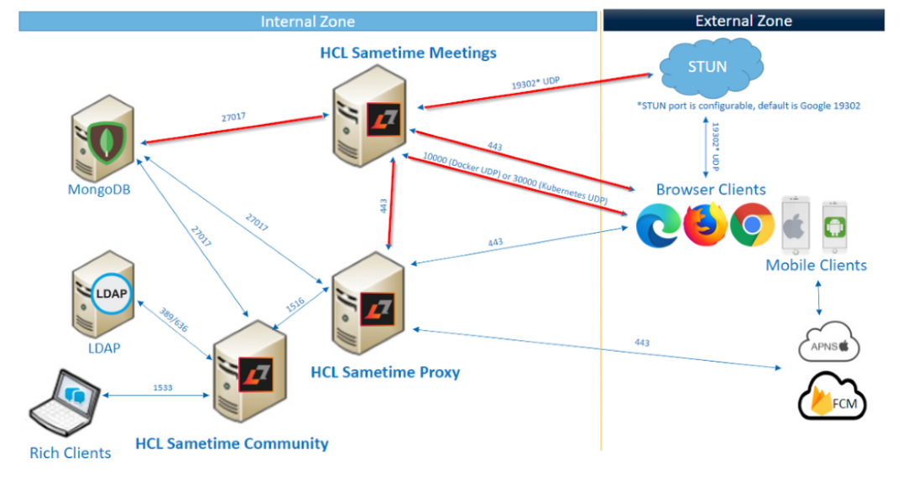

# Troubleshooting the Sametime server {#troubleshooting_meeting .concept}

Use this information on troubleshooting and logging tools to diagnose and resolve problems affecting the HCL Sametime server.

It is helpful when debugging an issue to understand which container logs to review for a specific issue. The remainder of this section will introduce commonly reported issues, how to troubleshoot them and known causes.

When installing Sametime Meetings on Docker or Podman, the following server image are loaded.

-   meetings-auth.node
-   meetings-recordings.node
-   meetings-web
-   meetings-prosody
-   meetings-jicofo
-   meetings-jvb
-   meetings-jigasi
-   meetings-jibri
-   meetings-persistence

The following table describes the images that are important.

|Meeting images|Description|
|--------------|-----------|
|meetings-auth.node|Responsible for authentication through the nginx proxy to the Sametime Proxy server. The Sametime Proxy server in turn connects to the Sametime Community server for authentication.|
|meetings-web|Front end web server that uses the nginx proxy.|
|meetings-jvb|Responsible for the jitsi video bridge.|
|meetings-jibri|Responsible for the meeting recordings.|
|meetings-persistence:|Responsible for the MongoDB connection to create or retrieve Meeting room names and settings.|

These Meeting images work together to support all the required Meeting features. On Docker, the docker-compose-yml file defines the Meeting server configuration. The Meeting server environment details are defined in the custom.env file.

**Note:** These values are case sensitive and must be entered in lower case.

## Meeting server connections {#section_hnm_mll_ywb .section}

The following image highlights the Meeting server connections and port. Ensure the Meeting server is not blocked or prevented from successfully making these connections.



## Common installation issues {#section_r41_xll_ywb .section}

-   Verify that the CentOS shipped with Docker is installed, but not the most recent which is required.Issue the following command to confirm that the version is 9.03.13.

    ``` {#codeblock_xgd_rnl_ywb}
    docker version
    ```

-   Confirm that the user has the appropriate permissions.

    ```
    docker-compose logs -f nginx
    ```

    If a Permission denied message is returned, the user doesn't have the appropriate permissions as shown in the following example.

    ``` {#codeblock_j5g_14l_ywb}
    
    nginx_1       | [s6-init] making user provided files available at /var/run/s6/etc...exited 0. 
    nginx_1       | [s6-init] ensuring user provided files have correct perms...exited 0. 
    nginx_1       | [fix-attrs.d] applying ownership and permissions fixes... 
    nginx_1       | [fix-attrs.d] done. 
    nginx_1       | [cont-init.d] executing container initialization scripts... 
    nginx_1       | [cont-init.d] 01-set-timezone: executing... 
    nginx_1       | [cont-init.d] 01-set-timezone: exited 0. 
    nginx_1       | [cont-init.d] 10-config: executing... 
    nginx_1       | mkdir: cannot create directory '/config/nginx': Permission denied 
    nginx_1       | mkdir: cannot create directory '/config/keys': Permission denied 
    ```


The following messages

-   Docker-compose: command is not found message is displayed when running the ./install.sh install program.

    confirm running as a user with access to the docker-compose location. Additional confirm docker-compose is correctly installed. For more information, see [Install Docker Compose](https://docs.docker.com/compose/install/)

    ``` {#codeblock_tvl_r4l_ywb}
     
    
                        Starting composition... 
    
                        ./install.sh: line 48: docker-compose: command not found 
    
                        [root@meetings tmp]# 
    
     
    
    ```


**Note:** After an install failure, you must delete the ./sametime-config directory before attempting another install.

## Meetings server common issues {#section_i4q_2ml_ywb .section}

If after the installation completes and you can't access the meeting home page, run the following command from the Linux Shell.

``` {#codeblock_djb_4pl_ywb}
docker-compose logs -f nginx
```

Sample error from the log:

``` {#codeblock_u5c_kml_ywb}

nginx_1       | [cont-init.d] 10-config: exited 0.
nginx_1       | [cont-init.d] 10-set-server-env: executing...
nginx_1       | [cont-init.d] 10-set-server-env: exited 0.
nginx_1       | [cont-init.d] done.
nginx_1       | [services.d] starting services
nginx_1       | [services.d] done.
nginx_1       | nginx: [emerg] host not found in upstream "chat.mysametimetrial.com" in /config/nginx/meet.conf:18
nginx_1       | nginx: [emerg] host not found in upstream "chat.mysametimetrial.com" in /config/nginx/meet.conf:18
nginx_1       | nginx: [emerg] host not found in upstream "chat.mysametimetrial.com" in /config/nginx/meet.conf:18
```

The SAMETIME\_PROXY\_HOST and SAMETIME\_PROXY\_PORT values are in the custom.env file. These values must be reachable by the docker container. If you see "host not found in upstream", update or correct DNS so the host is resolvable. Alternatively, the docker-compose.yml file can be updated so the host name is resolvable locally. Add the host name and IP to the `extra_hosts` setting in the `nginx` section of the docker-compose.yml file \(at the bottom\). To enable the changes, restart by running the following commands:

``` {#codeblock_lxh_1ql_ywb}

docker-compose down
docker-compose up -d
```

Alternatively, the docker-compose.yml file can be updated so the host name is resolvable locally. Add the host name and IP to the "extra\_hosts" setting in the nginx section of the docker-compose.yml file \(at the bottom\). To enable the changes, restart by running the commands docker-compose down and docker-compose up -d. For detailed instructions, see step 3 [here](t_installing_sametime_docker.md).

**Q2. Sametime Meeting login page is successful, but 'oops' message is received when logging in?**

**A2.** Check and confirm:

-   If the meetings policy is enabled on the Sametime Community server.
-   If JWT secrets are correct and enabled on the Sametime Community server.
-   If you can log in to the Sametime Community and Proxy servers after making the JWT changes.
-   Check that the proxy hostname is resolving as expected in the docker container. 500 error in nginx logs on the /user/connect request will be found if this is the case.
-   Review NGINX logs from the Meeting server.

**Q3. Entering a Meeting, receiving infinite "`Loading Meeting...`"**

**A3.** Review Meeting server jvb logs for errors. Confirm the DOCKER\_HOST\_ADDRESS in the custom.env file is correct and a rout-able IP address. Update or correct DNS so the host is resolvable.

Other known causes:

-   Virtual Sound Driver not installed.
-   Unable to connect to STUN server\(s\).
-   Review Meeting server jvb logs.
-   Capture and review HAR file from a browser client.
-   Confirm Port 10000 \(docker\) or 30000 \(kubernetes\) UDP is not blocked.

**Q4. Can’t create a Meeting Room.**

**A4.** The Meetings 11.6 Release requires a connection to MongoDB. \(This was not required in the pre-release version\). Can re-use existing MongoDB server or create one specific for Meetings.

**Sametime Meetings Best Practices**

## Best practices {#section_uvt_mml_ywb .section}

-   Run as root/sudo access.
-   Run this command to access the docker shell for a given Meeting image.

    ``` {#codeblock_qzj_4ml_ywb}
    docker-compose exe <auth/jvb/nginx> /bin/sh 
    
    ```

    **Note:** Replace <auth/jvb/nginx\> with the Meeting image you want to access.

-   From the docker shell you can confirm DNS, firewalls and other details that may differ from the host system.
-   To start and stop the Sametime Meetings server, run these commands from Linux shell:
    -   To Start:

        ``` {#codeblock_tzj_4ml_ywb}
        docker-compose up -d 
        ```

    -   To Stop:

        ``` {#codeblock_uzj_4ml_ywb}
        docker-compose down 
        ```


For Sametime Meeting issues, the Meeting server services/container logs will vary depending on the issue.

-   For Meeting page failing to load or Login issues, get NGINX and AUTH logs with relevant times.
-   For Meeting Recording issues, get JVB and JIBRI logs with relevant times.
-   For Meeting Loading issues or STUN issues, get JVB logs with relevant times.

**Parent Topic: **[Troubleshooting](troubleshooting.md)

