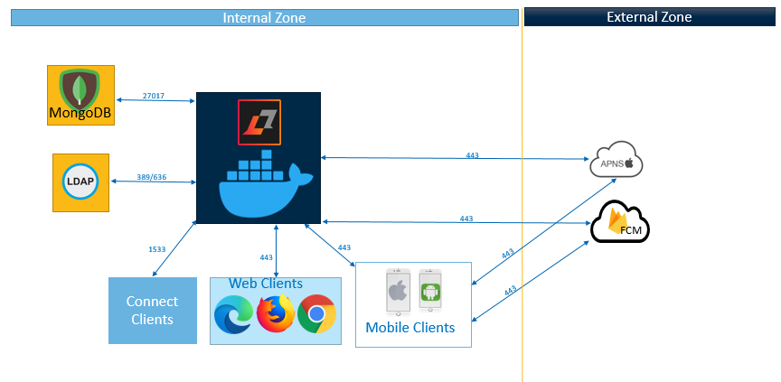
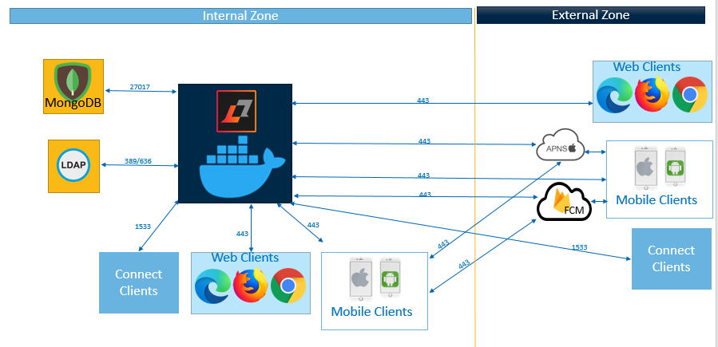

# Planning considerations for chat {#topology_chat .concept}

See [Ports used by Sametime services](ports_sametime.md) for more details on which ports are required to be open on firewalls.

## Small internal chat-only deployments {#section_olj_3nt_v5b .section}

For small internal deployments, a single Docker system can be deployed to support web chat, mobile chat, and chat users with desktop clients \(such as the Sametime Connect and Embedded Sametime client in HCL Notes\).

An example of a small deployment includes a single Docker deployment of Sametime, MongoDB Server, and the LDAP directory.

Figure 1 shows an example of a small internal deployment that only includes chat. 

In the above example, “desktop clients” are the Sametime Connect client and Sametime Embedded client \(inside HCL Notes\) for desktops. Browser clients can include other HCL applications such as HCL Verse, HCL iNotes, and HCL Connections, which have chat and presence integration with Sametime.

You can use the mobile client app on your internal Wi-Fi network if devices are able to connect to Sametime on port 443. Mobile apps can be used internally; however, be aware that the mobile clients still need access to the Apple \(APNS\) and Google \(FCM\) servers for push notifications \(notifying the user of new messages\). As an additional option, Sametime supports proxying the notifications if you have a third-party proxy to do so.

## Small chat-only environments with internet access {#section_dzj_jqt_v5b .section}

Figure 2 shows a small chat-only environment that includes internet access to Sametime. 

In this example, you can open port 443 on the firewall to support mobile clients on the internet. You can open TCP port 1533 to support desktop clients. Instead of placing Sametime in the internal zone, you can also place Sametime in a DMZ or on the external zone.

**Parent Topic: **[Planning the network topology and connectivity](topology.md)

