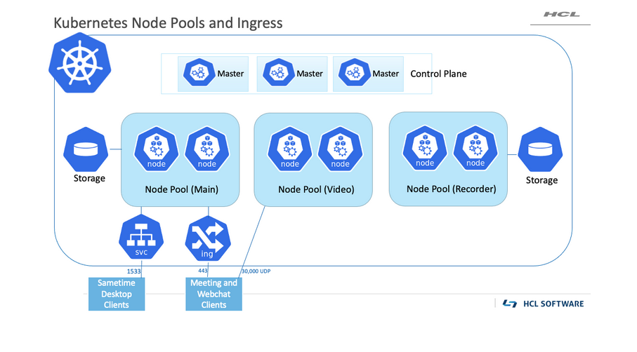
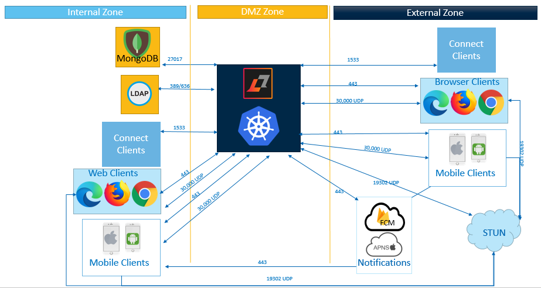
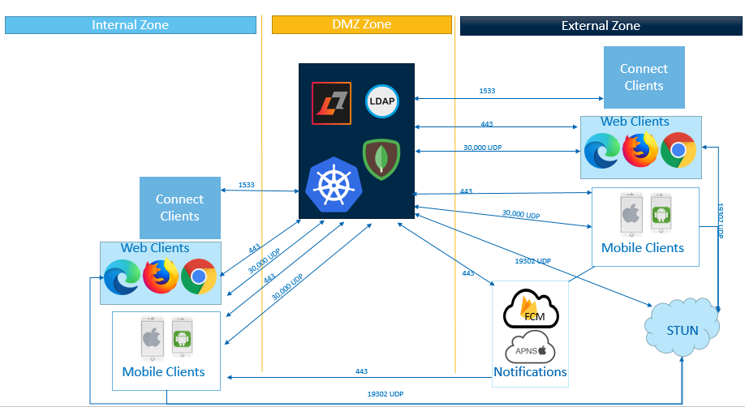

# Considerations for Sametime Premium {#topology_premium .concept}

Sametime Premium deployments are supported on Docker or Kubernetes.

If you are unfamiliar with these technologies, refer to [Platforms](c_planning_platforms.md). To learn more about Kubernetes, see [An Overview of Kubernetes](https://www.hcltech.com/blogs/overview-kubernetes).

Media audio and video streams over UDP port 10,000 for Docker or UDP 30,000 for Kubernetes. Sametime requires a STUN server if any user is attending from behind a firewall. The default configuration comes with the public Google STUN server configured using UDP Port 19302 configured; however, any STUN server can be used. Both clients and the Sametime services need connectivity to the STUN service. For more information, see [Session Traversal Utilities for NAT \(STUN\)](session_traversal_utilities.md). The following examples show several scenarios on how to deploy Sametime to include external users.

## Small Sametime Premium deployment on Docker {#section_lb3_tsv_v5b .section}

If your environment includes a DMZ, you can place Sametime in the DMZ and open the required ports.

In this example, clients can connect to Sametime from both inside the internal network as well as from the Internet. Browser clients and Mobile clients connect to Sametime using HTTPS port 443, and UDP port 10,000. These clients also connect directly to STUN on the Internet \(or internally if installed as an optional configuration\) on port 19302 UDP. Mobile clients must connect to the push notification services on the Internet in order to receive chat notifications in the client. Sametime desktop clients \(those that are installed rich clients—Sametime Connect and Sametime embedded\) are connecting on port 1533 TCP.

The following graphic shows a small HCL Sametime Premium with internet access using Docker. 

## Larger Sametime Premium deployments {#section_ftl_zsv_v5b .section}

If you have a medium- or large-size user base, you can deploy Sametime with Kubernetes. Kubernetes can be installed as an on-premise configuration or by leveraging a third party Kubernetes service such as Google Kubernetes Engine \(GKE\) or Amazon’s Elastic Kubernetes Service \(EKS\), among others.

When you deploy Sametime in Kubernetes, the Kubernetes cluster requires three node pools. Each node pool performs a different function. One node pool is dedicated to video, a second one for recorders, and a main node pool for all other Sametime pods. The number of nodes in each node pool determines the capacity of the environment. An ingress controller is used to handle front-end connections from users to the web chat and meeting https services. Media streams are over UDP port 30,000 and connect directly to the video node pool. Sametime desktop clients connect to a Sametime Mux Kubernetes service \(svc\) on port 1533 \(TCP\).

The following graphic shows Kubernetes node pools and ingress. 

Connectivity for end users is very similar to the Docker deployment. The difference is UDP port 30,000 is used for media streams instead of port 10,000. There may be multiple nodes in the video node pool, and clients must be able to reach each one on port 30,000.

The following graphic shows an overview of connectivity in a Kubernetes deployment.

For a fully containerized environment, it is possible to also run MongoDB as a Kubernetes cluster, which may require additional licensing from MongoDB. LDAP can also run as a container, and Sametime supports LDAP v3 compliant directories. Domino LDAP can also run in Kubernetes.

The following graphic shows a fully containerized Sametime Premium Deployment. 

-   **[Managing Sametime features](managing_sametime_premium.md)**  
HCL Domino users are entitled to limited use of HCL Sametime chat capabilities.

**Parent Topic: **[Planning the network topology and connectivity](topology.md)

