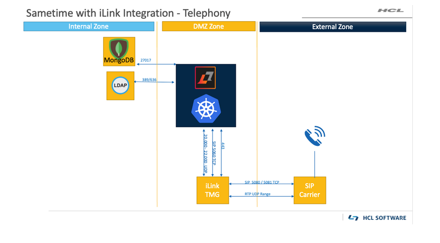

# Considerations for telephony {#topology_telephony .concept}

Integration with the Teamcall Message Gateway \(TMG\) application from iLink, telephony services can be added to your Sametime environment to allow for telephone access to chats and meetings.

TMG provides two types of end user experiences:

Dial in
:   Phone numbers are assigned to the Sametime Meeting service and each telephony enabled meeting has a unique pass code. This allows users to use their phones to dial in to a meeting.

Dial out
:   Dia out allows users to dial a phone number from the meeting to join another user to the Sametime meeting.

The iLink TMG can leverage your existing on-premise SIP Trunk, or a SIP Provider/Carrier service from a third-party. With this configuration, the SIP and RTP protocols are used between:

-   the Meeting service and the iLink TMG server
-   the iLink TMG server and the SIP Provider/Carrier or SIP Trunk

For more details on the iLink product, see the [iLink](https://www.ilink.de/en/index.html) website.

The following graphic shows a network environment with iLink integration.

**Parent topic:**[Planning the network topology and connectivity](topology.md)

