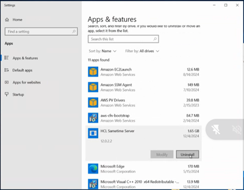
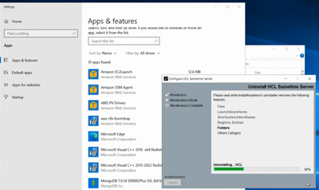

# Uninstalling Sametime Chat on Windows

You can uninstall Sametime Chat for Windows using your Windows Control Panel.

## About this task

1.  Navigate to your Windows Control Panel and select HCL Sametime Server click Unistall to continue.
    

2.  The Uninstall program will launch.  
             

3.  Unstall is complate, click Done.    

 

