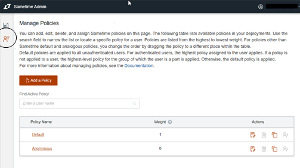
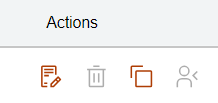

# Managing policies

Sametime policies allow administrators to control user access to features.

Two predefined policies are automatically assigned to users. You can also create custom polices that fit your company's requirements and user access to Sametime feature. Which policy that is automatically assigned depends on whether the user is authenticated or not. You can also create custom polices that fit your company's requirements.

Policies are only applied from the primary Sametime community defined in the client. Additional server communities' policies are not pushed down to the users' desktops. A user's primary Sametime community is the first community listed in their Sametime client Server Communities Properties settings.

To manage Sametime policies, you need access to the Sametime Admin. After accessing Sametime Admin, click the **Manage Policy icon** on the left side of the window.

From the Manage Policies window, you can create, assign, and view policy assignments, and more using the icons under **Actions**. To the right of each policy is the policy weight followed by actions. To know more about a policy, click the policy name.

To know more about a policy, click the policy name. The View/Edit Policy window opens where you can view and change features related to the policy.

---

-   **[Policy weight](adminui_policy_weight.md)**  
Policy weights and group nesting levels are used to determine which policies take precedence over the attributes of other policies.
-   **[Policy types](adminui_policy_types.md)**  
There are three types of policies. The Anonymous and Default policies are predefined and cannot be deleted. There is only one of these policy types. All other policies are considered custom policies. There can be many of this type of policy.
-   **[Policy sections](adminui_policy_sections.md)**  
Each policy contains several sections.
-   **[Adding a policy](adminui_policy_add.md)**  
You can add a policy by creating a new policy, or by copying and modifying an existing policy.
-   **[Deleting a policy](adminui_policy_delete.md)**  
You can delete policies no longer needed.
-   **[Modifying a policy](adminui_policy_modify.md)**  
Policy attribute can be modified for all policy types.
-   **[Assigning users and groups to policies](adminui_policy_assign.md)**  
Policies are not used until assigned to users or groups.
-   **[Finding active policies associated with user or group](adminui_policy_view_active.md)**  
You can view policies assigned to a user or group.

**Parent topic:   **[Administering](administering.md)

