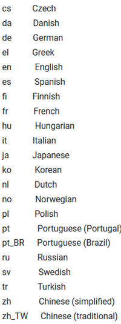

# Installing the Connect client in silent mode 

The Connect client can be installed on a user's machine either by sending the install package to the user or by pushing the installation to the user's machine. In either case, the installation is an silent install.

Silent install is available only on the Windows platform.

The batch file used to start the install process is setup.bat. This batch file contains the setup.exe command with default parameter values to run the installer. You can modify the parameters. The following table shows the command parameters and default values.

Table 1. Parameters in the setup.bat file

|Parameter|Description|
|---------|-----------|
|install.log|The name of the log file created by the installer. The file is created in the same directory as the installer.|
|INSTALLDIR=installation\_directory|The full path of the installation directory.|
|STSILENTINIFILE=ini\_file\_name|Name of the configuration INI file. The default is silentinstall.ini .|
|STSILENTINSTALL=TRUE|Indicates the install is a silent install. This value must be TRUE for silent execution.|

The setup.bat file contains several different commands that can be used to perform different installation functions. Some of the commands are commented out by default, you can remove the comment tag and updated if the function is needed. Detailed explanations are included in the setup.bat file.

The silentinstall.ini file contains configuration parameters for the Connect client. The settings are used to populate the community-config.xml file with server connection information and other parameters required by the installer. The following table describes the configuration parameters.

Table 2. Parameters in the silentinstall.ini file

|Parameter|Description|
|---------|-----------|
|LAPAGREE=NO|Specify whether to accept the license agreement. This value must be `YES`. The default value is `NO`. You must change this parameter to YES for silent install to work.|
|CREATECOMMUNITYTEMPLATE=true|Specifies whether community properties such as STSERVERNAME and STCOMMUNITYNAME are ignored. When set to false, the community-config.xml is not created in the installation\_directory\\rcp\\deploy folder. All community-config properties should be put in the plugin\_customization.ini in the installation\_media\_root\_directory-root\_directory\\deploy directory. If using a custom plugin\_customization.ini, ensure that the value is set to `true`.|
|STSERVERNAME=stservername.domain.com|The fully qualified host name of the Sametime server. Normally this is the same as the home server specified in the person document.|
|STCOMMUNITYNAME= community\_name|The name of the community.|
|STSERVERPORT=1533|The IP port number of the Sametime server.|
|STSENDKEEPALIVE=true|Flag for sending keep-alive signal.|
|STKEEPALIVETIME=60|Indicates how often to check the connectivity between the client and server, allowing timely notification if disconnected. The default is 60 seconds.|
|STCONNECTIONTYPE75=direct|The type of connection. Valid values are: direct, useBrowserSettings, tls-direct, http-direct, socks4-proxy, socks5-proxy, http-proxy, https-proxy, and reverse-proxy. The default value is direct.|
|STPROXYHOST=proxy\_host\_name|The host name of the proxy server. If you are not using a proxy, leave this field blank.|
|STPROXYPORT=proxy\_port\_number|The port number of the proxy sever. If you are not using a proxy, leave this field blank.|
|STRESOLVELOCALY75=|The proxy resolves local flag . Specify true or false.|
|STPROXYUSERNAME=|The user name for the proxy server. If you are not using a proxy, leave this field blank.|
|STPROXYPASSWORD=|The password for the proxy server. If you are not using a proxy, leave this field blank.|
|`STCOUNTRYLANG=en`|The language to be used by the Connect client. Specify the language code for the language to be used. The default vlaue is English. If a value is not specified, the client computer's default language is used. |
|   ||
|STAUTHSERVERURL=|The URL of the authorization server for the SSO token log in. If you are not using an authorization server, leave this field blank.|
|STLOGINBYTOKEN=false|Specify whether to use the Login By Token flag. The default value is false.|
|STUSEAUTHSERVER=false|Specify whether to use the authorization server flag. The default is false.|
|STLOGINATSTARTUP=false|Specify whether the client logins at startup. The default is false.|
|STUNINSTALL75=1|Specify whether to uninstall an existing 7.5 client if present.|
| | 1 Uninstall 7.5.x client if found|
| | 0 Leave 7.5.x client installed|
|STUNINSTALLPRE75=1|Specify whether to uninstall an existing pre-7.5 client if present.|
|  | 1 Uninstall pre-7.5 client if found. This is the default value.|
|  | 0 Leave pre-7.5 client installed|

After you have edited the files to tailor the installer for your specific requirements, you can distribute the files to your end users. If the users are to run the installer, instruct them users to copy both of the files to the same directory and then execute setup.bat to install Sametime Connect.

1.  Download the client installation package.

2.  Copy the setup.bat and the silentinstall.ini files from the root of the download, and then update the files to meet your requirements.

3.  Update the setup.bat file if necessary.

4.  Update the silentinstall.ini file to match the environment.

5.  Send or copy the updated files to the user's computer.

6.  To start the install, run the following command:

    ``` {#codeblock_mgv_nr5_lvb}
    setup.bat -silentinstall.ini
    ```


**Parent Topic:  **[Installing Sametime clients](installing_sametime_clients.md)

