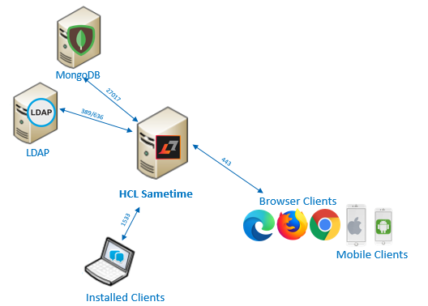

# System requirements {#system_requirements .concept}

System requirements include the minimum HCL Sametime and HCL Sametime Premium requirements, such as operating systems, hardware, software, and more.

The minimum requirements must be available to install the product successfully. For details on system requirements, see the [System requirements](https://support.hcltechsw.com/csm?id=kb_article&sysparm_article=KB0108387) article.

The graphic below shows a simple topology with the required components: MongoDB and LDAP. The system requirements article, along with the installation and configuration topics, provides details for including them in your environment.

**Parent Topic:  **[Prerequistes](c_planning_prereqs.md)

