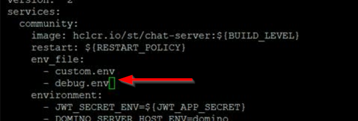

# Resolving problems with business cards {#t_resolving_business_cards .task}

If business cards are not displaying user information as expected, first check the server configuration, then the client, and finally, the business cards themselves.

To check the server configuration, verify that the storage repository, such as LDAP used with the Sametime server is configured correctly. A configuration problem is the most likely cause of problems with business cards. For more information, see [Setting up business cards](admin_st_buscard.md).

If the configuration is correct, next verify that the business card information on requested from the clients is working correctly. For this, trace the UserInfo servlet flows to verify that the UserInfo servlet is working correctly. The UserInfo servlet runs on the server retrieves business card information on request from clients and responds to client requests. To determine if there are errors on the exchange of information, enable the UserInfo Debug trace.

If the UserInfo servlet on the server is responding correctly, enable client-side tracing to determine what is happening on the client. Follow the instructions in [Logging and tracing on the Sametime Embedded and Connect clients](t_logging_tracing.md). For Web clients, review the Proxy service logs and capture a browser HTTP Archive \(HAR\) file to review the business card information received.

**Parent topic:   **[Troubleshooting](troubleshooting.md)

## Enabling the UserInfo Debug trace on Docker {#task_cmx_2pp_r5b}

1.  If a debug.env doesn't exist in the directory where the installation package was decompress, you must create it.

2.  Add the following line to the debug.env file.

    ``` {#codeblock_plt_jpp_r5b}
    STI__debug__USERINFO_DEBUG_LEVEL=5 
    ```

3.  Add the debug.env in the community section of the docker\_compose.yml file.

    

4.  Save the file.

5.  Start the Sametime server to apply the changes and enable the trace.

    ``` {#codeblock_jck_klq_r5b}
    docker compose up -d
    ```


## Enabling the UserInfo Debug trace on Kubernetes {#task_ufj_rpp_r5b}

1.  Edit the values.yaml file, changing the `enableCommunityDebug` property from false to true. Save this change.

2.  Edit sameteime-community-logging ConfigMap, and add the following line to the data section.

    ``` {#codeblock_cpg_fqp_r5b}
    STI__debug__USERINFO_DEBUG_LEVEL: "5"
    ```

    For example:

    ``` {#codeblock_dpg_fqp_r5b}
    kubectl edit cm sametime-community-logging
    ```

3.  Apply your changes to the environment.

    Verify that you are in the helm directory and run the following command to apply changes. Specify the Sametime deployment name for your environment. The default for Sametime Premium version 12 is sametime.

    ``` {#codeblock_iyn_51d_d5b}
    helm upgrade sametime\_deployment\_name .
    ```

    **Note:** Be sure to include the dot at the end. It is part of the command.

    If you are unsure of your deployment name, issue the helm list command to find the name. If you upgraded from an earlier Sametime release, the default name is sametime-meetings.

4.  Restart the pods with the changes. Use the kubectl scale command to scale the pods to zero and then to one that have been changed. You must run the commands for each pod that the change affects.

    1.  Run the following command to scale the pod to zero.

        Scale the pod to zero, where pod\_deployment\_name is the pod name.

        ``` {#codeblock_cwz_mwc_d5b}
        
        kubectl scale deploy pod\_deployment\_name --replicas=0
        
        ```

    2.  Run the following command to scale the pod to one.

        ``` {#codeblock_i2c_4wc_d5b}
        
        kubectl scale deploy pod\_deployment\_name --replicas=1
        ```


