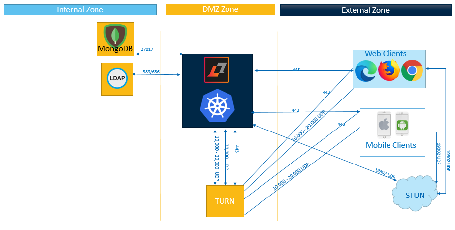

# Determining where to install Sametime {#topology_turn .concept}

You can extend access to Sametime outside of your internal network to attendees on the Internet. Sametime can be installed in the demilitarized network zone \(DMZ\); however, the required ports for connectivity need to be opened on the firewalls surrounding the DMZ. You can also use a third-party Kubernetes cloud provider such as Amazon EKS, Google GKE, or another third-party Kubernetes provider to deploy Sametime. For more information, see the [Deploying Sametime 12 on Google Kubernetes Engine](https://support.hcltechsw.com/csm?id=kb_article&sysparm_article=KB0099614) guide.

For example, Sametime can be installed in a demilitarized network zone \(DMZ\) or internal zone, which requires ports open to the network.

If there are users or attendees who might have a restrictive network environment, consider implementing a TURN service.

TURN \(Traversal Using Relays over NAT\) is a protocol that relays network traffic. It is an optional service that you can deploy with Sametime to improve the end user experience when attendees and users of Sametime Meetings do not have connectivity to UDP port 30,000. If the user has access to ports 10,000–20,000 UDP, then TURN can relay the traffic over this range instead. The user connects to the TURN server instead of Sametime directly. If the user is in a very restrictive environment and has no UDP ports available to use, then the TURN server can be used to relay traffic over TCP port 443. It is important to note that although port 443 is used for this purpose, it is not considered HTTP traffic; it is audio and video data.

Sametime does not ship with a TURN server, but a third-party server can be used, such as CoTURN. CoTURN is the TURN server that has been tested with Sametime.

For more details on TURN, see [Setting up a TURN server](turnserver_intro.md).

**Parent Topic:  **[Network planning for meetings](network_planning.md)

