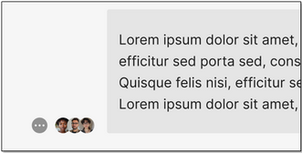
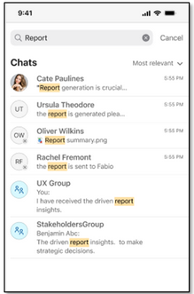
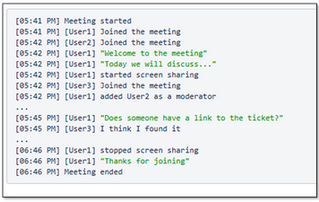

# What's New in HCL Sametime 12.0.3

HCL Sametime and HCL Sametime Premium 12.0.3 provides many new features, enhancements and fixes to servers and clients. 
For information on these new features and enhancements, refer to the following:

## New Features

HCL Sametime 12.0.3 introduces a range of enhancements designed to improve communication, increase productivity, and deliver a more modern, seamless user experience across chat and meetings.

### Chat Read Receipts

Chat users can now see when their messages have been [read by recipients](chat_read_receipts.md), reducing uncertainty and enabling more efficient, responsive conversations.

### Mobile Chat Search

Quickly locate specific messages or conversations from your mobile device using keywords and filters. This feature makes it easy to retrieve important information without wasting time scrolling through chat history.    For more information, refer to the New features in HCL Sametime 12 for [Andriod 12.0.17](https://help.hcl-software.com/sametime/12.0/android/c_whats_new.html) / [iOS 12.0.21](https://help.hcl-software.com/sametime/12.0/ios/c_whats_new.html)

### Meeting Recording Transcripts

[Meeting recordings](meeting_transcripts.md) now can be automatically transcribed, providing a searchable, written record of the discussion in the meeting report. This helps teams stay aligned, follow up on action items, and ensure no key points are missed.

### Mobile Auto Status & Persistent Notifications

User status on mobile devices will now automatically update based on activity, even through server session timeouts. Persistent notifications help users stay informed and maintain accurate availability, minimizing disruptions.  For more information, refer to the New features in HCL Sametime 12 for [Andriod 12.0.17](https://help.hcl-software.com/sametime/12.0/android/c_whats_new.html) / [iOS 12.0.21](https://help.hcl-software.com/sametime/12.0/ios/c_whats_new.html) 

### Improved Guest User Experience

Joining a meeting as a guest is now faster and easier, with fewer steps and a more intuitive interface. These improvements help reduce friction for external participants and support more seamless collaboration.

### Premium Chat Features Now in Domino CCB

File transfer, screen capture, and instant meeting link sharing are now included in the standard Domino Complete Collaboration Bundle (CCB) entitlement—at no extra cost—enhancing chat functionality for all users.

### Chat and Meetings Accessibility

Sametime is now aligned with accessibility requirements, offering screen reader support, keyboard navigation, high-contrast display options, and accessible meeting controls to support all users across web and mobile.

### Enchanted and React Design Updates

The updated user interface now features the latest HCL Enchanted and React design systems, delivering a modern, consistent experience that aligns with other HCL Digital Solutions products for better usability and visual continuity.

With HCL Sametime 12.0.3, we're making communication more efficient, inclusive, and integrated—so your teams can collaborate with confidence, wherever they are.

## Fixes

See the [HCL Sametime and HCL Sametime Premium 12.0.3 Fix List](https://support.hcltechsw.com/csm?id=kb_article&sysparm_article=KB0121688) article for a list of fixes included in this release. 

## Prerequisites and Requirements 

See [HCL Sametime and HCL Sametime Premium 12.0.3 System Requirements](https://support.hcltechsw.com/csm?id=kb_article&sysparm_article=KB0121489).

## Download and Installation Instructions

HCL Sametime v12.0.3 is available for download at [My HCLSoftware](https://my.hcltechsw.com/). For additional information, refer to the Knowledge Article, [What is My HCLSoftware](https://support.hcl-software.com/csm?id=kb_article&sysparm_article=KB0109011)? 

For installation instructions, refer to the [HCL Sametime Administration Guide 12.0.3](https://opensource.hcltechsw.com/sametime-doc/v1203/admin/installation_sametime.html).
